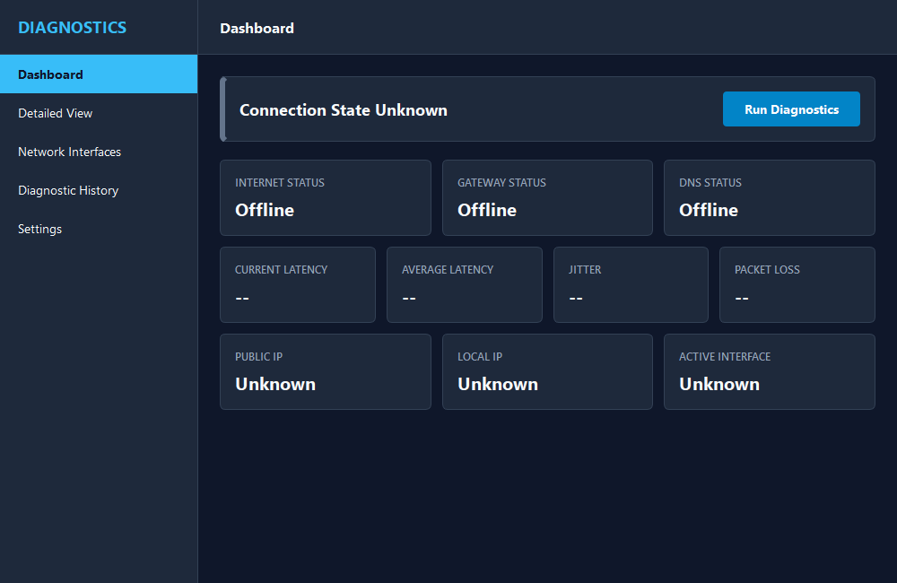
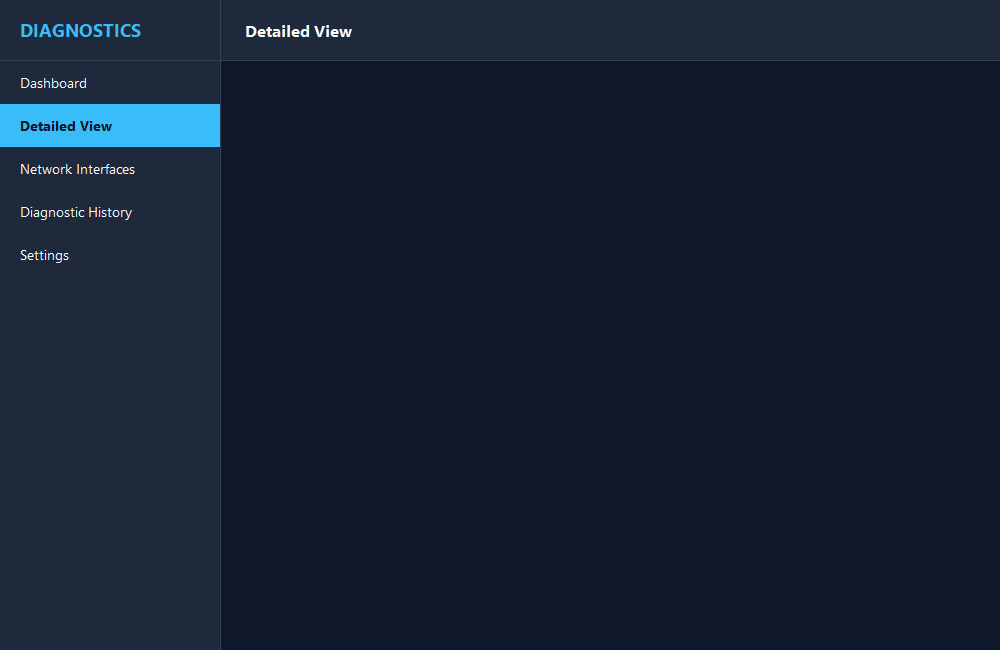
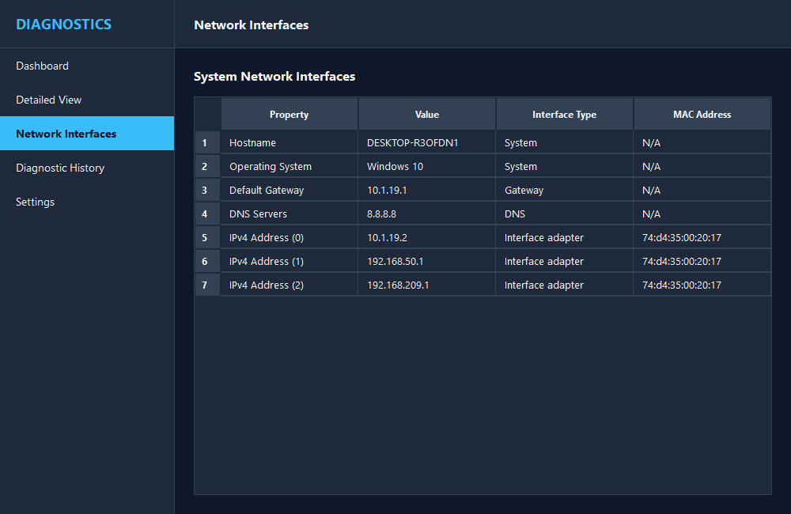

# Connection Diagnostics Tool

A professional-grade desktop application built with Python and PySide6 to analyze network, gateway, DNS, and HTTP/HTTPS connectivity.

## Features

- **Sequential Pipeline**: Checks availability in a logical sequence (Interfaces -> Gateway -> DNS -> Host -> Latency -> Stability).
- **Non-blocking GUI**: Utilizes PySide6 threading for all network operations.
- **Detailed Diagnostic View**: Clean UI displaying results, durations, error descriptions, and metrics (latency, jitter, packet loss).
- **System Info Dashboard**: Full adapter properties, default gateways, operating system version, and MAC address.
- **Persistent Storage**: Save historical diagnostic records, view detailed reports later, and clear database records.
- **Report Export**: Export session snapshots to JSON, CSV, or plain text formats.
- **Customizable Preferences**: Configure diagnostic timeout, ping counts, URLs, and port configurations.

## Architecture

- **`app/main.py`**: Entry point for the PySide6 Application.
- **`app/networking/`**: Platform-aware subprocess utilities and raw socket queries.
- **`app/diagnostics/`**: Sequential orchestration logic run inside background worker threads.
- **`app/storage/`**: Local JSON database persisting diagnostic logs.
- **`app/ui/`**: PySide6 widgets following a consistent, clean dark theme.

## Screenshots

### Dashboard


### Detailed Diagnostic view


### System Network Interfaces


## Requirements

- Python 3.8+
- PySide6
- pytest (for testing)

## Installation & Running

1. Install dependencies:
   ```bash
   pip install -r requirements.txt
   ```
2. Run the application:
   ```bash
   python app/main.py
   ```
3. Run tests:
   ```bash
   python -m pytest
   ```

## Supported Platforms
- **Windows**: Full support.
- **Linux / macOS**: Fallbacks gracefully when interface queries differ.

## License
Licensed under the MIT License.
