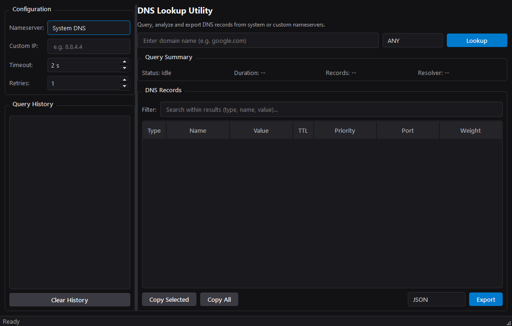
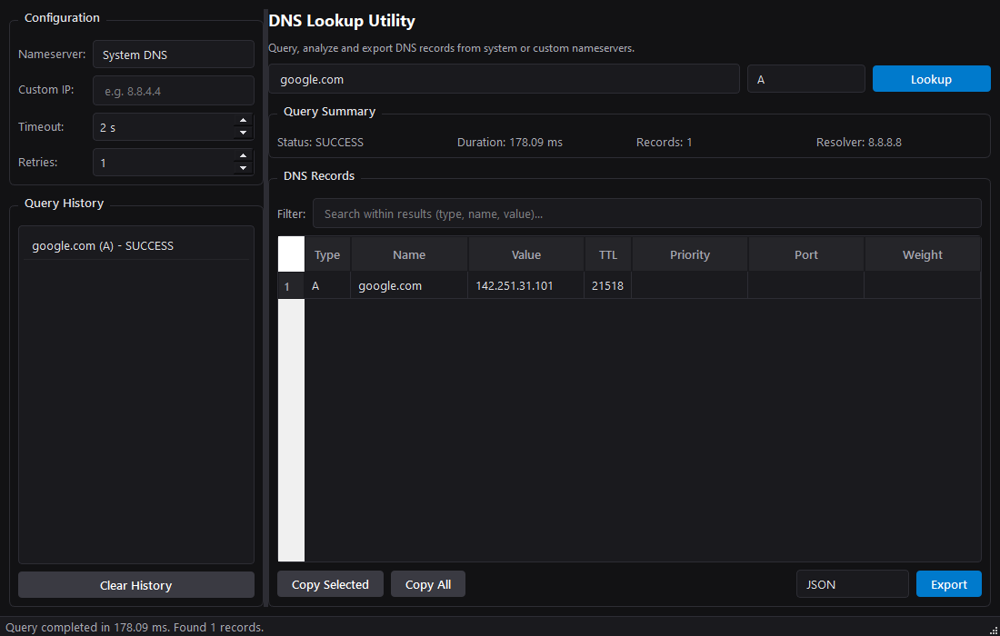
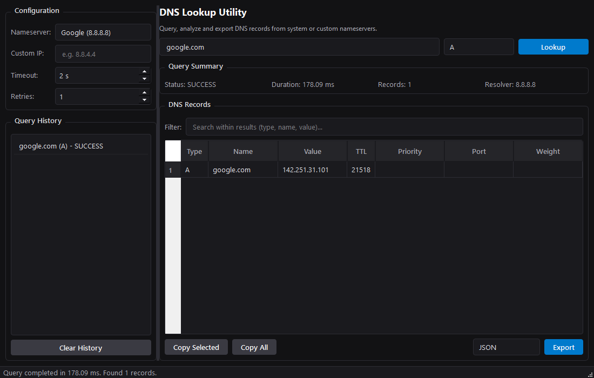

# DNS Lookup Tool

A professional, production-quality DNS lookup desktop utility designed for developers, network administrators, and systems engineers. Built using Python, PySide6, and dnspython, this application features a clean, responsive interface, asynchronous queries, query history tracking, custom nameservers, and structured file exporters.

## Features

- **Asynchronous Resolution**: DNS lookups run in background threads using QThread, ensuring the UI remains responsive.
- **Custom Resolvers**: Configure lookups to use the system default resolver or custom IPv4/IPv6 nameservers. Predefined entries are provided for Cloudflare, Google, and Quad9.
- **Record Types**: Supports query lookups for A, AAAA, CNAME, MX, NS, TXT, SOA, PTR, SRV, and CAA records, as well as multi-type (ANY) queries.
- **Live Filtering**: Search through returned DNS records instantly by type, name, or value without re-querying the server.
- **Query History**: Access past lookups, click to reload parameters, and clear records when no longer needed.
- **Structured Exporting**: Export lookup results and metadata to JSON, CSV, or TXT file formats.
- **Keyboard Shortcuts**: Designed for efficiency:
  - `Enter`: Run lookup
  - `Ctrl + L`: Focus domain input
  - `Ctrl + R`: Refresh current lookup
  - `Ctrl + C`: Copy selected table rows to clipboard
  - `Escape`: Clear current filter

## Requirements

- Python 3.11+
- PySide6 >= 6.0.0
- dnspython >= 2.0.0

## Installation

1. Clone or download this repository.
2. Install the required runtime dependencies:
   ```bash
   pip install -r requirements.txt
   ```

## Running the Application

To run the desktop utility:
```bash
python main.py
```

## Screenshots

Here are screenshots showing the application's user interface:

### 1. Idle / Startup State


### 2. Query Results Grid


### 3. Resolver Configuration


## Supported DNS Record Types

- **A**: Address records
- **AAAA**: IPv6 address records
- **CNAME**: Canonical name records
- **MX**: Mail exchange records
- **NS**: Nameserver records
- **TXT**: Text records
- **SOA**: Start of authority records
- **PTR**: Pointer records for reverse resolution
- **SRV**: Service location records
- **CAA**: Certification authority authorization records
- **ANY**: All supported types queried collectively

## Project Structure

```text
src/
├── app/
│   └── application.py
├── core/
│   ├── dns/
│   │   └── resolver.py
│   └── models/
│       ├── dns_record.py
│       └── query.py
├── exporters/
│   └── formats.py
├── storage/
│   └── store.py
└── ui/
    ├── theme.py
    ├── workers.py
    └── windows/
        └── main_window.py
tests/
└── test_dns.py
main.py
requirements.txt
```

## Testing

Run the test suite using Python's standard unittest framework:
```bash
python -m unittest tests/test_dns.py
```

## Export Formats

- **JSON**: Fully structured format containing query parameters, query duration, server details, timestamps, and resolved fields.
- **CSV**: Spreadsheet-ready table featuring separate metadata headers and columns.
- **TXT**: Plaintext format showing aligned fields for terminal/log output.

## License

This project is licensed under the MIT License.
