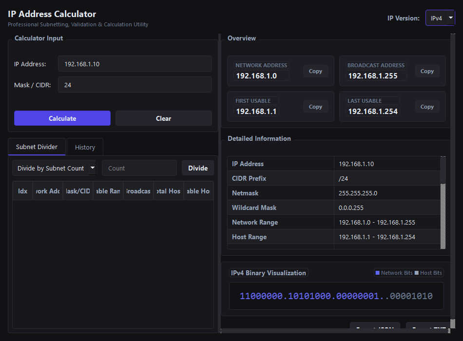
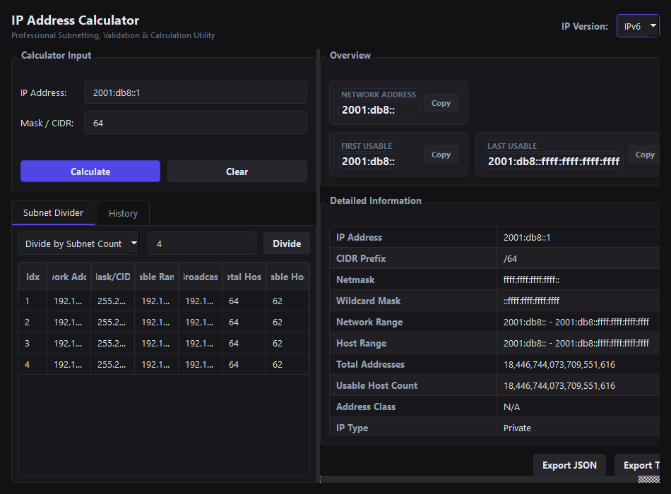
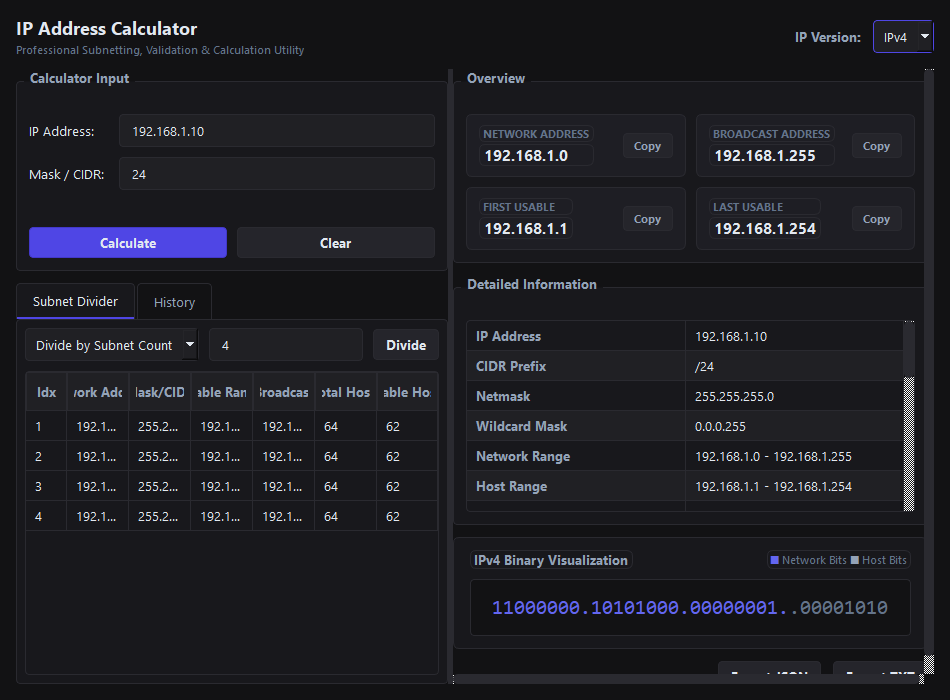

# IP Address Calculator

A professional-grade IPv4 and IPv6 subnet calculator and network configuration utility built with Python and PySide6. Designed for network engineers, systems administrators, and developers who require fast, accurate, and offline networking calculations.

## Screenshots

### IPv4 Details


### IPv6 Details


### Subnet Divider


## Features

- **Dual Protocol Support**: First-class support for both IPv4 and IPv6 calculation and subnetting.
- **Robust Input Validation**: Whitespace sanitization, flexible CIDR/netmask parsing, and graceful error reporting.
- **Detailed Network Information**:
  - Classful detection (A, B, C, D, E) for IPv4.
  - Network, broadcast, wildcard mask, and usable host range calculations.
  - Classification checks: Private, Public, Loopback, Link-Local, Multicast, Reserved, and IPv4-mapped IPv6.
- **Subnet Divider**: Split networks based on a target subnet count or a target host count. Supports Variable-Length Subnet Masking (VLSM) metrics.
- **Visualizer**: Dynamic text-based binary visualization separating network bits and host bits.
- **Local History**: Fast, local cache of calculation history to quickly review and reuse past configurations.
- **Export Capabilities**: Clean, structured export of calculation results to JSON and TXT formats.
- **Accessibility & UX**: Professional dark theme styling, standard keyboard shortcuts, clean borders, and proper focus states.

## Architecture

The project adheres to strict separation of concerns:
- `src/main.py`: Bootstraps the application.
- `src/calculator/engine.py`: Encapsulates all subnet math using Python's standard `ipaddress` module.
- `src/calculator/validators.py`: Handles safe user input parsing and format conversions.
- `src/calculator/models.py`: Defines data representations for calculation results.
- `src/calculator/history.py` & `src/calculator/exporter.py`: Manage disk I/O for history cache and export files.
- `src/calculator/ui/`: Contains PySide6 windows, custom widgets, and stylesheet themes.

## Installation

1. Ensure Python 3.10+ is installed on your system.
2. Install the required dependencies:
   ```cmd
   pip install -r requirements.txt
   ```

## Usage

Start the application by running:
```cmd
python src/main.py
```

### Keyboard Shortcuts
- **Enter**: Calculate results
- **Ctrl + L**: Focus IP address input field
- **Ctrl + R**: Clear/reset current calculation
- **Ctrl + Shift + C**: Copy calculation summary to clipboard

## Testing

Run the automated test suite with:
```cmd
cmd /c "set PYTHONPATH=src && python -m pytest tests/"
```
