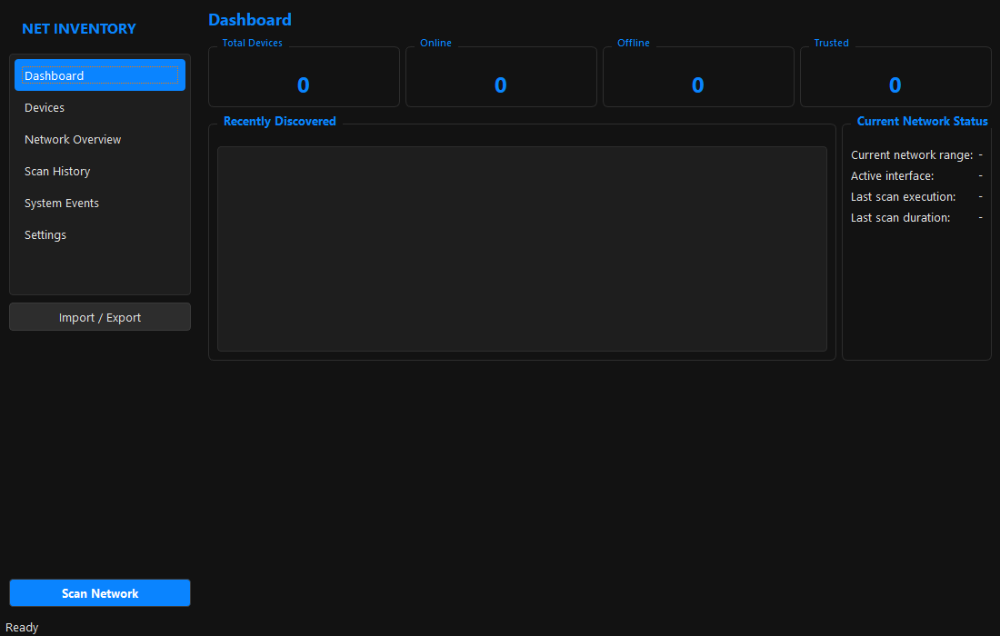
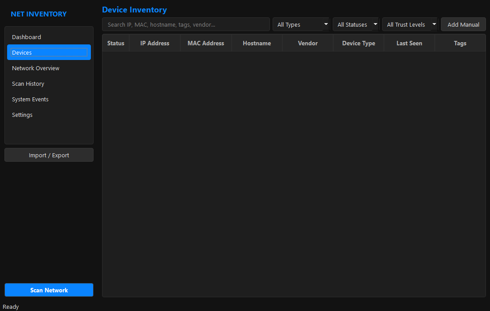
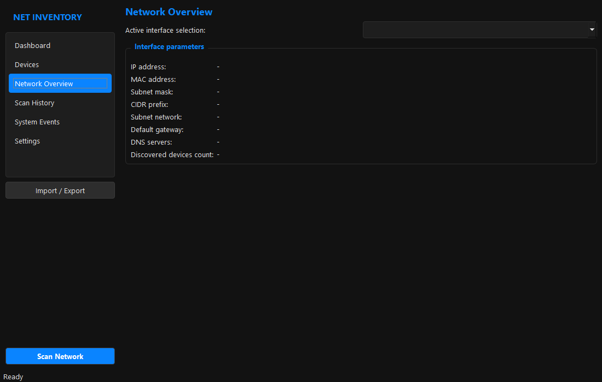
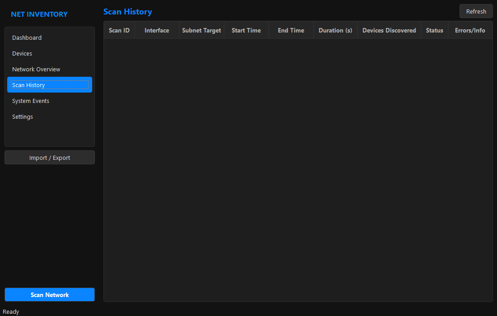
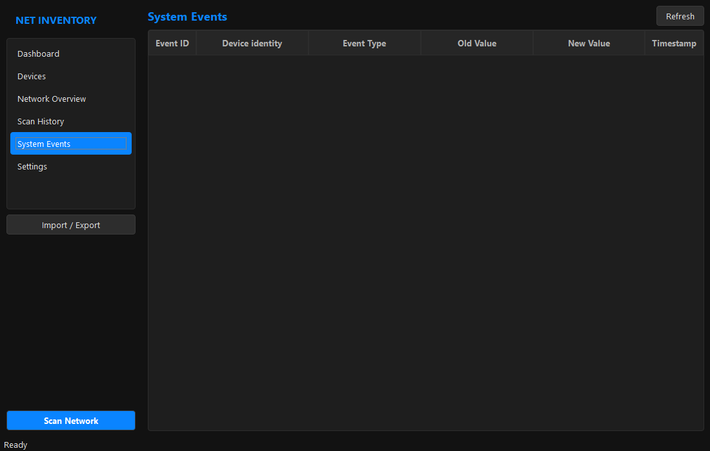
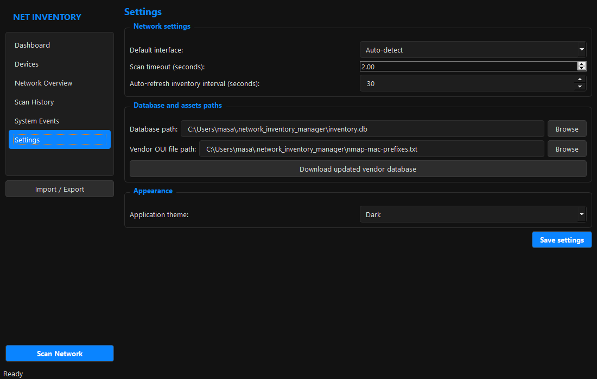

# Local Network Inventory Manager

A professional desktop application for discovering, monitoring, and managing local area network (LAN) devices. Built using Python, PySide6, SQLite/SQLAlchemy, and Scapy.

## Screenshots

### Dashboard


### Device Inventory


### Network Overview


### Scan History


### System Events


### Settings


## Supported Platforms

- Windows 10/11
- Linux (Ubuntu/Debian)
- macOS

## Prerequisites

- Python 3.12 or higher
- Administrator or root privileges for raw socket and packet scanning (ARP/ICMP)

## Installation

1. Clone the repository to your local machine.
2. Install the required dependencies:
   ```bash
   pip install -r requirements.txt
   ```

## Running the Application

To run the application:
```bash
python app/main.py
```

*Note: On Windows, running the terminal as Administrator before executing `app/main.py` is recommended for full ARP scanning capabilities. On Linux, execute using `sudo`.*

## Architecture Overview

The application utilizes a clean, decoupled design to separate responsibilities:

- **Core Module (`app/core/`)**: Handles logging configuration and JSON-based application settings persistence.
- **Database Model Layer (`app/models/`)**: Manages the persistence models (`Device`, `Tag`, `Scan`, `NetworkInterface`, `DeviceEvent`) using SQLAlchemy.
- **Repository Pattern (`app/repositories/`)**: Encapsulates data query operations and mutation logic.
- **Networking Controller (`app/networking/`)**: Inspects active adapters, and performs high-speed ARP/ICMP sweeps using Scapy, falling back to threaded socket probes if permissions are restricted.
- **User Interface (`app/ui/`)**: Contains views (Dashboard, Devices, Network Overview, Scans, System Events, Settings) built with PySide6.
- **Utilities (`app/utils/`)**: Provides validations (MAC/IP formats) and handles CSV/JSON import and export mechanisms.

## Limitations

- ARP discovery requires that the host's network card is on the same physical link/subnet as the targets.
- Without elevated permissions, Scapy raw packet creation will fail, causing the scanner to fall back to port scanning and system ping commands, which may take longer.
