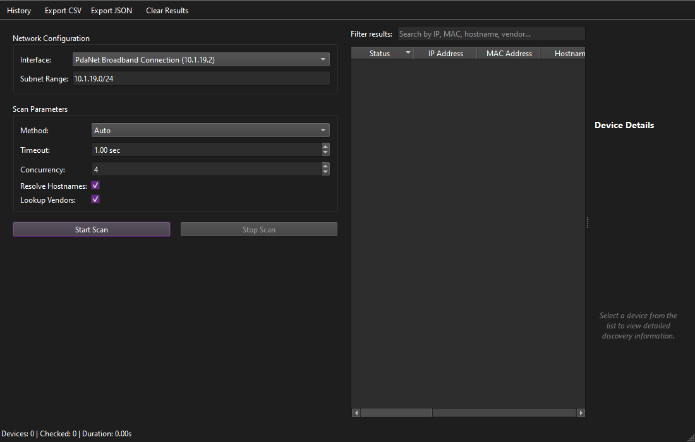

# Network Device Discovery Tool

A professional, high-performance desktop application built with Python and PySide6 to discover and inspect active devices on a local area network (LAN). It leverages Scapy for advanced network protocol discovery, caches results, queries local MAC manufacturer databases, resolves hostnames in background workers, and stores historical scan logs using SQLite.



## Features

- **Network Interface Detection**: Auto-detects local interfaces, IP addresses, netmasks, and default subnets.
- **Multi-Method Scanning**: 
  - **ARP Discovery**: Fast Layer 2 discovery for local network ranges.
  - **ICMP Discovery**: Layer 3 ping checks for routed segments.
  - **TCP Fallback**: High-speed, multi-threaded connection scanning (non-admin friendly fallback).
  - **Auto-mode**: Automatically falls back to TCP scanning if raw socket permission errors are encountered.
- **Local Vendor Resolution**: Offline lookup database matching MAC prefixes against the IEEE OUI database.
- **Reverse DNS Resolver**: Runs reverse IP lookups in background worker threads with caching to prevent UI freezes.
- **Scan Control & Progress**: Responsive progress tracking with start, stop, clear, and statistics.
- **Interactive Results Grid**: Sortable, filterable table with cell/row copying capabilities and double-click to view device details.
- **Persistent Scan History**: Local SQLite database storing previous runs, discovered devices, and historical statistics.
- **Data Exporting**: Export discovered hosts to clean UTF-8 encoded CSV and JSON formats.
- **Logging**: Integrated python logging for runtime diagnostics.

## Requirements

- Python 3.12 or newer
- Operating System: Windows, macOS, or Linux
- Npcap (on Windows) or libpcap (on macOS/Linux) for raw packet capture operations (required for ARP and ICMP scans)

## Installation

1. Clone or download the repository:
   ```bash
   git clone <repository-url>
   cd "Network Device Discovery Tool"
   ```

2. Create a virtual environment and activate it:
   ```bash
   python -m venv venv
   # On Windows:
   venv\Scripts\activate
   # On macOS/Linux:
   source venv/bin/activate
   ```

3. Install required dependencies:
   ```bash
   pip install -r requirements.txt
   ```

## Running the Application

Launch the desktop interface by executing:
```bash
python -m app.main
```

### Network Permissions & Privileges

Due to the nature of low-level packet crafting used by Scapy:
- **Windows**: Installing **Npcap** is highly recommended. Make sure to check the "support raw 802.11 traffic" option during Npcap installation. Raw socket operations require administrative privileges. If running without administrative access, the tool will automatically fall back to the multi-threaded **TCP scan** engine.
- **macOS/Linux**: You must run the application with superuser privileges (`sudo python -m app.main`) to open raw sockets for ARP/ICMP scanning.

## Architecture

The project is structured following clean coding principles and a separation of concerns:

- `app/core/`: Definitions of constants, settings, and common dataclasses.
- `app/discovery/`: Scan engine implementation including ARP, ICMP, TCP, and network interface detections.
- `app/services/`: Auxiliary business services (OUI lookup, hostname resolution, CSV/JSON exports, SQLite scan facade).
- `app/database/`: SQLite connection management, schemas, and parameterised SQL repositories.
- `app/workers/`: Threading wrappers utilizing Qt QThread for asynchronous background execution.
- `app/ui/`: UI layouts, custom table models, sidebars, and dialogue boxes.

## Testing

A suite of unit tests verifies the correctness of the database, network calculations, MAC OUI vendor resolution, and export functionality.

To execute tests:
```bash
python -m unittest discover -s tests
```

## Troubleshooting

- **No libpcap provider found warning**: This warning from Scapy indicates that Npcap/libpcap is not installed on the system. Install Npcap (Windows) or libpcap (Linux/macOS) to enable ARP/ICMP scanning. The application will remain functional and automatically use TCP scanning as a fallback.
- **Permission Denied**: Run the application as an Administrator (Windows) or with `sudo` (Linux/macOS) to allow ARP and ICMP packet crafting.

## Project Structure

```
network_device_discovery/
│
├── app/
│   ├── __init__.py
│   ├── main.py
│   ├── core/
│   ├── discovery/
│   ├── services/
│   ├── database/
│   ├── workers/
│   └── ui/
│
├── data/
│   └── oui.csv
│
├── tests/
│
├── requirements.txt
├── README.md
├── .gitignore
└── LICENSE
```

## License

This project is licensed under the MIT License - see the [LICENSE](LICENSE) file for details.

Copyright (c) 2026 XREFS0. All rights reserved.
