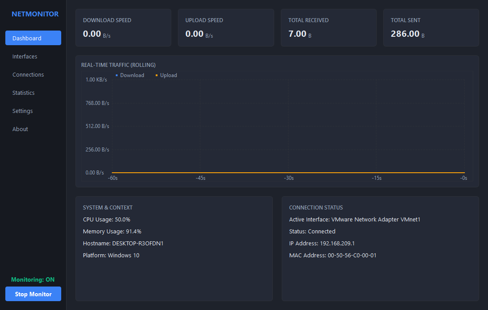
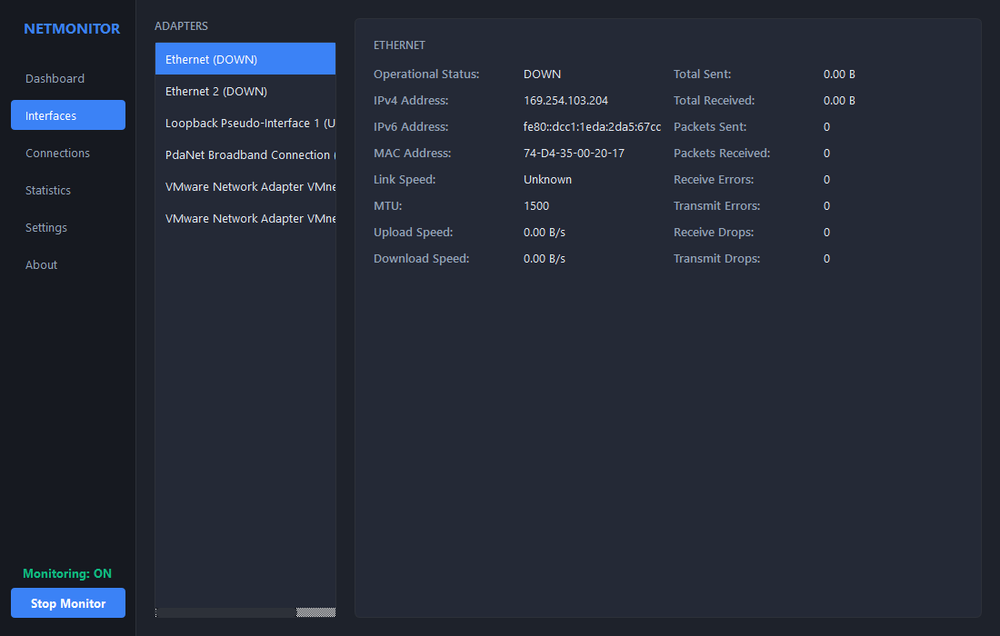
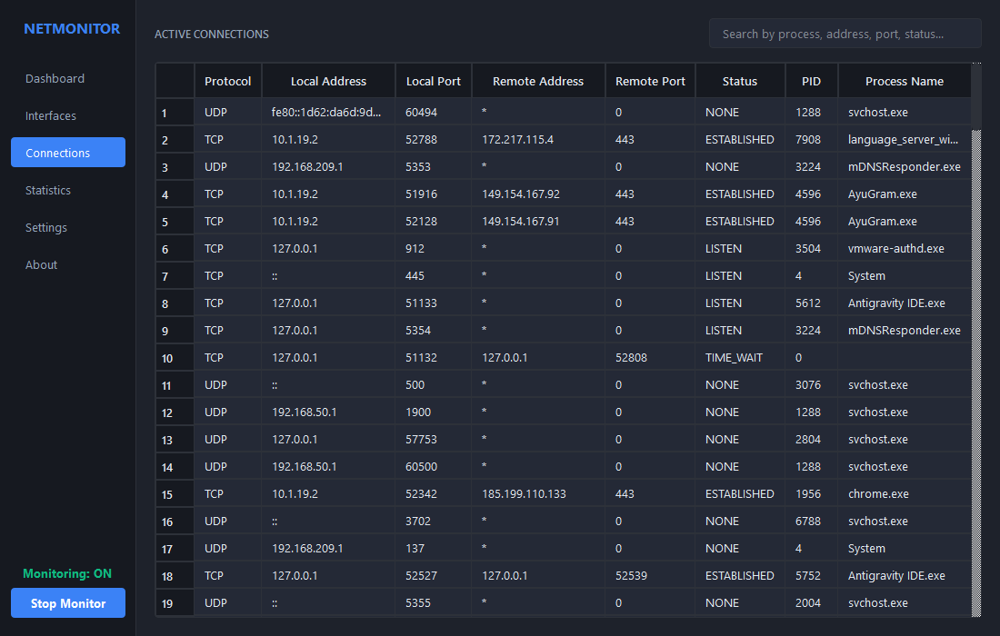
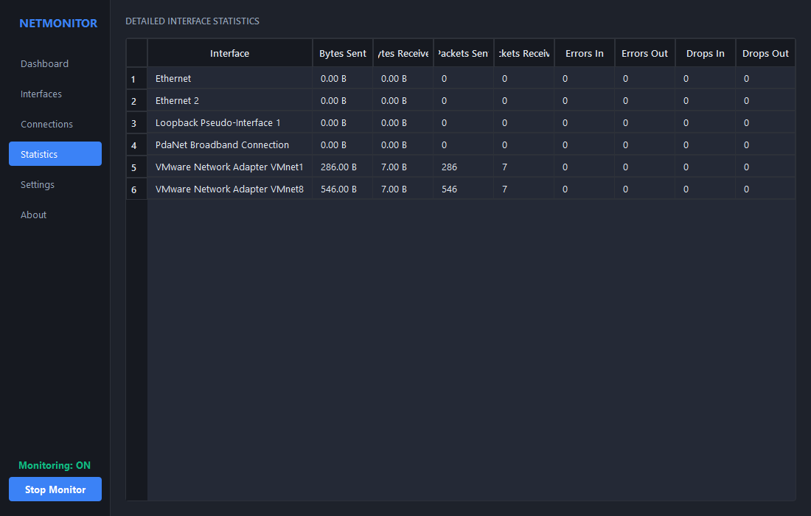
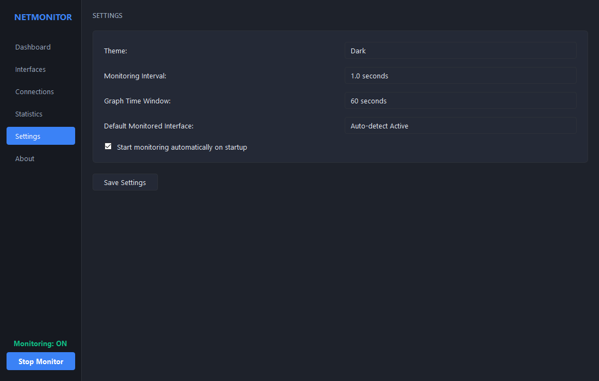
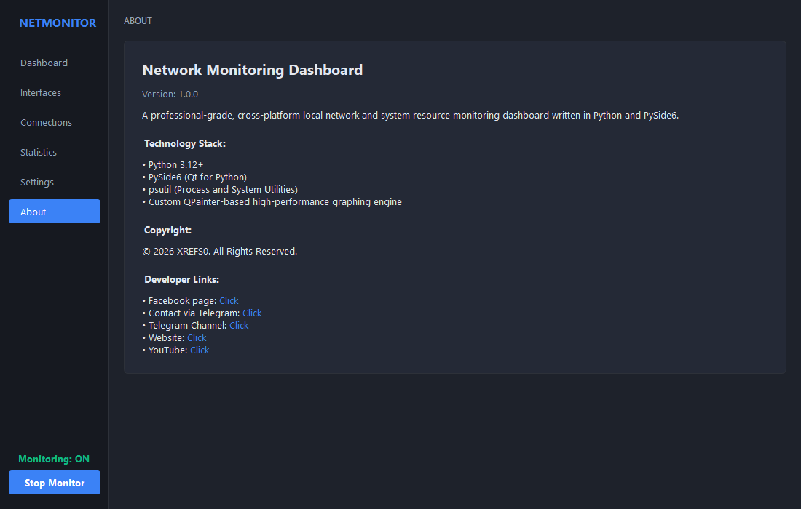

# Network Monitoring Dashboard

A professional cross-platform desktop application written in Python and PySide6 for real-time local network monitoring and system statistics.

## Screenshots

| Dashboard | Interfaces | Connections |
|---|---|---|
|  |  |  |

| Statistics | Settings | About |
|---|---|---|
|  |  |  |

## Features

- **Network Overview**: Displays real-time download and upload throughput, cumulative bytes, packet statistics, active adapter info, and connection states.
- **Interface Monitoring**: Comprehensive overview of all network adapters, operational states, hardware details (MAC/IP addresses), link speed, MTU, errors, and drops.
- **Real-Time Traffic Graph**: An optimized custom QPainter-based traffic graph showing throughput over a rolling window.
- **Active Sockets List**: Interactive table detailing TCP and UDP sockets, local/remote endpoints, connection status, PIDs, and process names.
- **System Overview**: Lightweight resource telemetry detailing CPU and memory footprints.
- **Configuration & Styling**: Persistent settings for sampling rate, rolling graph size, default adapter select, and light/dark theme toggle.

## Architecture

The project follows a clean, modular layer separation:
- **Core**: Dataclasses and static data models, JSON-based persistent config storage, and structured file logging.
- **Monitoring**: Decoupled sampling engine utilizing psutil and background worker running on a separate QThread to prevent GUI blocking.
- **UI**: PySide6 widgets, custom layout sheets (QSS), and decoupled modular views matching each application feature.
- **Utilities**: Standard unit formatter converting bytes, speed, and packets to human-readable representations.

## Requirements

- Python 3.12+
- PySide6
- psutil
- pytest (for test execution)

## Installation

1. Install requirements using pip:
   ```bash
   pip install -r requirements.txt
   ```
2. Or perform a editable local project installation:
   ```bash
   pip install -e .
   ```

## Running the Application

Start the dashboard using the python interpreter:
```bash
python -m src.netmonitor.main
```
Or if installed as a package, use the entry point:
```bash
netmonitor
```

## Testing

Execute tests using pytest:
```bash
pytest
```

## Project Structure

```
├── LICENSE
├── README.md
├── pyproject.toml
├── requirements.txt
├── src/
│   └── netmonitor/
│       ├── __init__.py
│       ├── main.py
│       ├── core/
│       │   ├── __init__.py
│       │   ├── config.py
│       │   ├── logger.py
│       │   └── models.py
│       ├── monitoring/
│       │   ├── __init__.py
│       │   ├── samplers.py
│       │   └── worker.py
│       ├── ui/
│       │   ├── __init__.py
│       │   ├── mainwindow.py
│       │   ├── themes.py
│       │   ├── views/
│       │   │   ├── __init__.py
│       │   │   ├── about_view.py
│       │   │   ├── connections_view.py
│       │   │   ├── dashboard_view.py
│       │   │   ├── interfaces_view.py
│       │   │   ├── settings_view.py
│       │   │   └── statistics_view.py
│       │   └── widgets/
│       │       ├── __init__.py
│       │       ├── metric_card.py
│       │       └── traffic_chart.py
│       └── utils/
│           ├── __init__.py
│           └── formatting.py
└── tests/
    ├── test_formatting.py
    └── test_monitoring.py
```

## Limitations & Permissions

- Inspecting connection process details requires matching user permissions. Socket process ownership (PID / name resolution) may omit processes requiring administrator or root capabilities.
- Platform support: Tested on Windows and modularly structured for Linux deployment.
