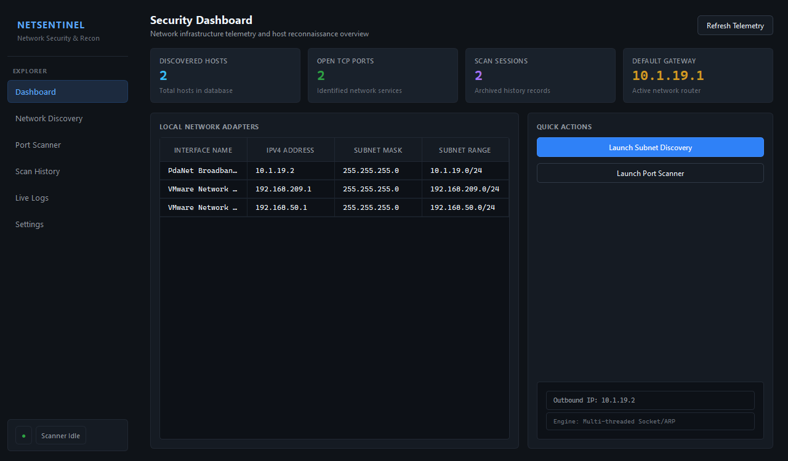
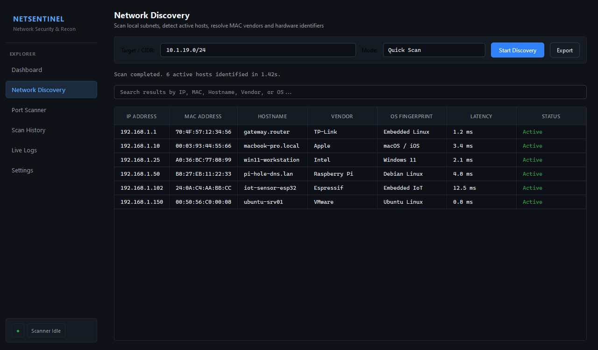
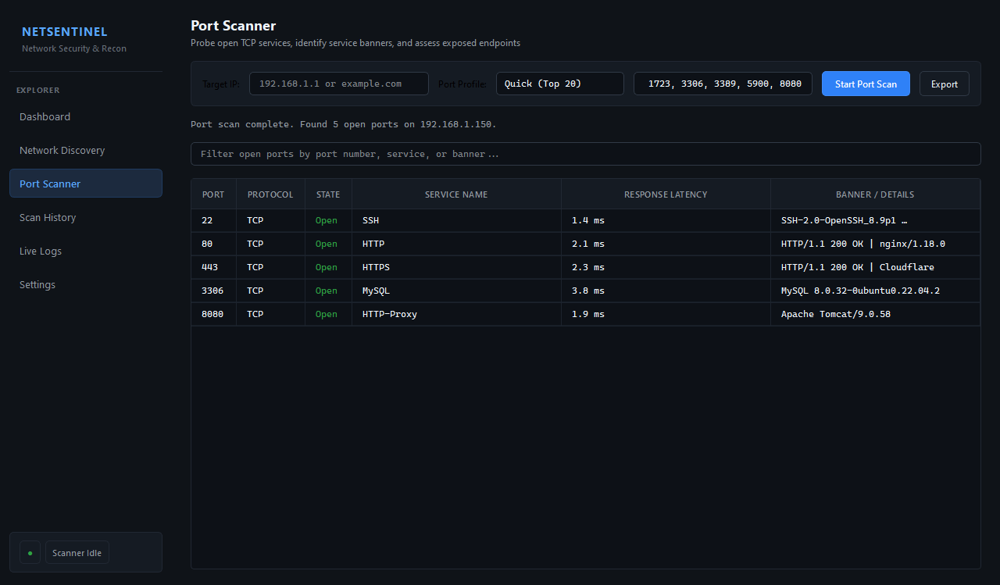
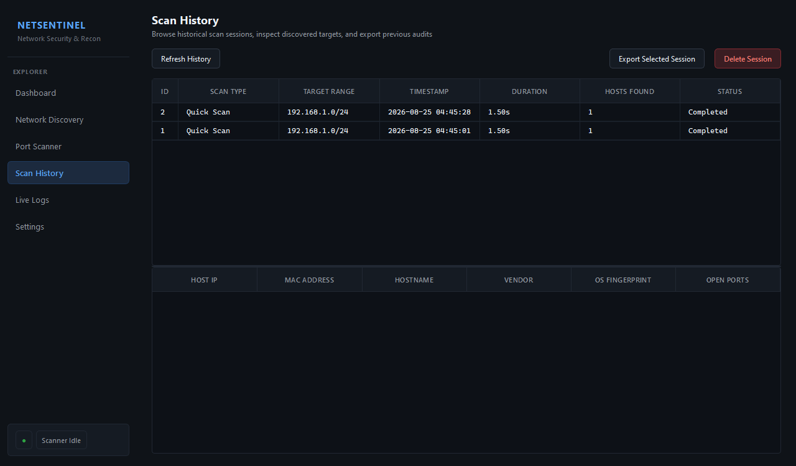
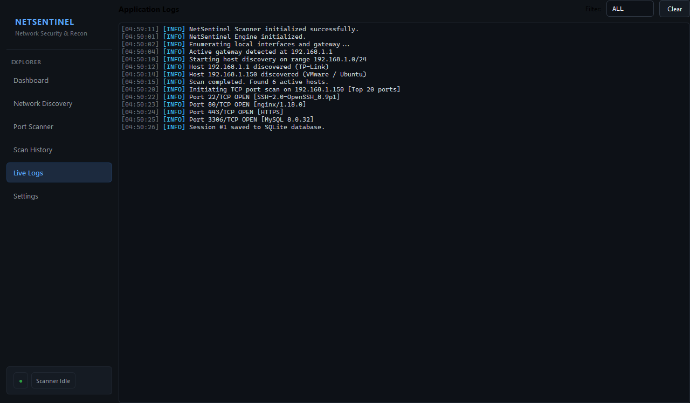
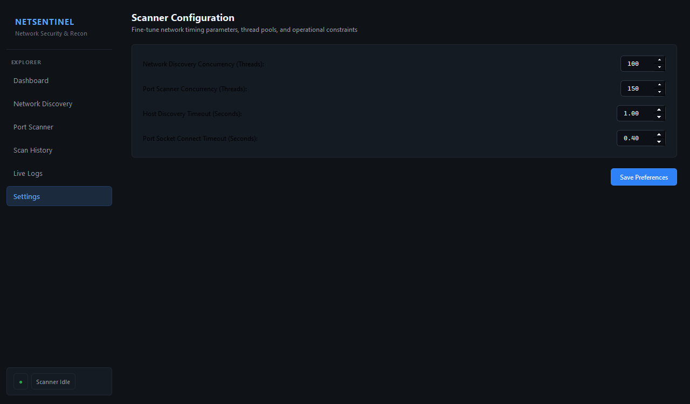

# NetSentinel - Network Scanner

NetSentinel is a modular, multi-threaded network discovery and security auditing desktop application built in Python 3 using PySide6, Scapy, and raw sockets.

Repository: https://github.com/XREFS0/Network-Scanner

---

## Overview

NetSentinel provides network reconnaissance, active host discovery, TCP port enumeration, and service banner inspection through an asynchronous, non-blocking desktop user interface.

## Screenshots

### Dashboard Overview


### Network Discovery


### TCP Port Scanner


### Scan History & SQLite Records


### Live Logs Console


### Scanner Configuration


---

## Key Features

- **Network Discovery**:
  - Supports CIDR ranges (e.g. `192.168.1.0/24`), IP intervals (`10.0.0.1-50`), single hosts, and domains.
  - Dual discovery pipeline: Scapy ARP scanning with concurrent TCP socket connect probing and system ARP cache resolution fallback.
  - Hardware vendor identification using an embedded IEEE OUI manufacturer database.
  - Reverse DNS hostname resolution and round-trip response time measurement.

- **TCP Port Scanner**:
  - High-concurrency socket engine with custom timeout and thread controls.
  - Port profiles: Quick (Top 20), Standard (Top 100), Web & Cloud, Remote Management, Databases, and Custom Ranges.
  - Banner grabbing for HTTP, SSH, FTP, SMTP, and MySQL services.

- **Passive OS Fingerprinting**:
  - TCP/IP initial TTL heuristics combined with banner analysis.

- **Data Persistence & Reporting**:
  - Built-in SQLite database storing sessions, discovered hosts, open ports, and logs.
  - Multi-format report export: JSON, RFC-4180 CSV, and formatted TXT security reports.

- **Desktop Interface**:
  - Dark cybersecurity theme built with PySide6.
  - Real-time search, table filtering, and live log stream viewer.

---

## Project Structure

```
NetworkScanner/
├── app/
│   ├── core/
│   │   ├── config.py           # Configuration, scan presets, port dictionaries
│   │   ├── exceptions.py       # Domain-specific exception hierarchy
│   │   └── logger.py           # Structured logging with file & UI signal distribution
│   ├── database/
│   │   ├── db_manager.py       # SQLite connection manager & migrations
│   │   ├── repository.py       # Data access object for sessions, devices, and ports
│   │   └── schema.sql          # Relational SQLite schema definition
│   ├── models/
│   │   ├── device.py           # Host device domain model
│   │   ├── port.py             # Port scan result domain model
│   │   └── session.py          # Scan session domain model
│   ├── scanner/
│   │   ├── arp_scanner.py      # Network discovery engine (ARP & socket probe)
│   │   ├── network_detector.py # Interface, local IP, gateway, and subnet detection
│   │   ├── os_detector.py      # OS fingerprinting heuristics
│   │   ├── oui_lookup.py       # IEEE OUI hardware vendor database
│   │   ├── port_scanner.py     # Concurrent TCP port scanner
│   │   └── worker.py           # QThread non-blocking worker threads
│   ├── ui/
│   │   ├── components/
│   │   │   ├── log_viewer.py   # Live log stream viewer
│   │   │   ├── metric_card.py  # Telemetry metric cards
│   │   │   └── sidebar.py      # Navigation sidebar
│   │   ├── views/
│   │   │   ├── dashboard_view.py # Dashboard overview
│   │   │   ├── discovery_view.py # Subnet discovery view
│   │   │   ├── history_view.py   # Scan history view
│   │   │   ├── port_view.py      # Port scanner view
│   │   │   └── settings_view.py  # Configuration view
│   │   ├── main_window.py      # Primary window layout
│   │   └── theme.py            # Stylesheet and color tokens
│   └── utils/
│       ├── exporter.py         # JSON, CSV, and TXT report exporters
│       ├── helpers.py          # Formatting utilities
│       └── validator.py        # IP and port range validation
├── ScreenShot/                 # Application screenshots
├── test_scanner.py             # Automated unit test suite
├── main.py                     # Entry point
├── requirements.txt            # Python dependencies
├── LICENSE                     # MIT License
└── README.md                   # Documentation
```

---

## Requirements

- Python 3.10+
- Windows 10/11
- Npcap (optional, for Scapy raw packet operations)

---

## Installation

1. Clone the repository:
   ```bash
   git clone https://github.com/XREFS0/Network-Scanner.git
   cd Network-Scanner
   ```

2. Install dependencies:
   ```bash
   pip install -r requirements.txt
   ```

---

## Usage

Run the main entry file:
```bash
python main.py
```

Run test suite:
```bash
python test_scanner.py
```

---

## License

This project is licensed under the MIT License. See [LICENSE](LICENSE) for details.

Copyright (c) 2026 XREFS0. All rights reserved.
