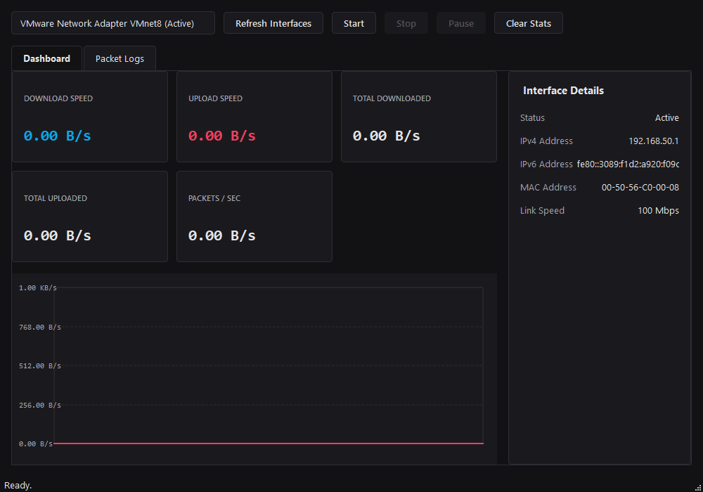

# Network Traffic Monitor

A production-quality desktop application designed to monitor network traffic in real time. Built using Python 3.12+ and PySide6, it offers high-performance system-level traffic throughput analytics and optional packet-level header logs.

## Project Overview

The Network Traffic Monitor enumerates local network adapters, queries system-level bytes and packet counters, computes network bandwidth consumption using precise monotonic timers, and charts throughput history. It separates thread execution paths so that background data sampling and Scapy sniffing operate outside the graphical interface thread, preventing UI lag.

## Screenshots

### Dashboard


### Packet Logs


## Features

- **Real-Time Bandwidth Tracking**: High-precision display of download/upload transfer rates and cumulative volume.
- **Custom Painter Chart**: Double-buffered, auto-scaling line graph plotting download and upload speed histories.
- **Adapter Enumeration**: Scan local interfaces to view link speeds, statuses, IPv4, IPv6, and MAC addresses.
- **Control System**: Fully interactive start, stop, pause, resume, and data clearing mechanisms.
- **Thread-Isolated Sniffing**: Background packet-level header ingestion tracking protocol types (TCP, UDP, ICMP, DNS, HTTP, HTTPS/TLS).
- **Graceful Error Recovery**: Resilient monitoring loops that recover when adapters are disconnected or disabled.

## Technology Stack

- **Python 3.12+**
- **PySide6**: Qt bindings for Python GUI representation.
- **psutil**: High-speed, system-level process and system utility library.
- **Scapy**: Selective header capturing (optional dependency for log table).

## Requirements

- Python 3.12 or newer.
- Operating System: Windows 10/11 (fully supported), Linux (architecturally prepared).
- Optional: Npcap/WinPcap on Windows, or root/cap_net_raw capabilities on Linux (only needed for optional packet-level capturing).

## Installation

1. Clone the repository:
   ```bash
   git clone https://github.com/XREFS0/Network-Traffic-Monitor.git
   cd Network-Traffic-Monitor
   ```

2. Create and activate a virtual environment:
   ```bash
   python -m venv .venv
   .venv\Scripts\activate
   ```

3. Install required packages:
   ```bash
   pip install -r requirements.txt
   ```

## Running the Application

To run the application:
```bash
python app/main.py
```

*Note: Administrative privileges or Npcap installations are only required to log packet-level summaries in the "Packet Logs" tab. Standard stats collection and the throughput chart operate correctly under normal user accounts.*

## Permissions

The core bandwidth monitor uses `psutil` which runs under standard user permissions. The optional packet-level scanner uses raw sockets or pcap libraries via Scapy. If the driver is missing or user privileges are insufficient to invoke pcap, packet logging displays a warning in the status bar and turns off automatically while statistics collection remains fully functional.

## Platform Compatibility

- **Windows**: Fully supported. Works out of the box for stats; requires Npcap for live packet views.
- **Linux**: Cleanly structured so that Linux support shares the main stats gathering and PySide6 layouts.

## Project Structure

```
network-traffic-monitor/
├── app/
│   ├── __init__.py
│   ├── main.py
│   ├── config.py
│   ├── models/
│   │   ├── __init__.py
│   │   └── traffic.py
│   ├── network/
│   │   ├── __init__.py
│   │   └── interfaces.py
│   ├── workers/
│   │   ├── __init__.py
│   │   ├── stats_worker.py
│   │   └── packet_worker.py
│   ├── ui/
│   │   ├── __init__.py
│   │   ├── style.py
│   │   ├── chart.py
│   │   ├── dashboard.py
│   │   ├── packets.py
│   │   └── main_window.py
│   └── utils/
│       ├── __init__.py
│       └── formatting.py
├── tests/
│   ├── __init__.py
│   ├── test_formatting.py
│   └── test_interfaces.py
├── .gitignore
├── README.md
├── requirements.txt
└── pyproject.toml
```

## Development Instructions

To install in editable mode with development dependencies:
```bash
pip install -e .[dev]
```

## Testing

Execute unit tests using pytest:
```bash
python -m pytest
```

## Limitations

- The live packet log captures and displays protocol headers only. It does not perform deep packet payload analysis.
- Encrypted traffic payload is not parsed.
- Virtual interface metrics are subject to host operating system reports.

## License

This project is licensed under the MIT License.
