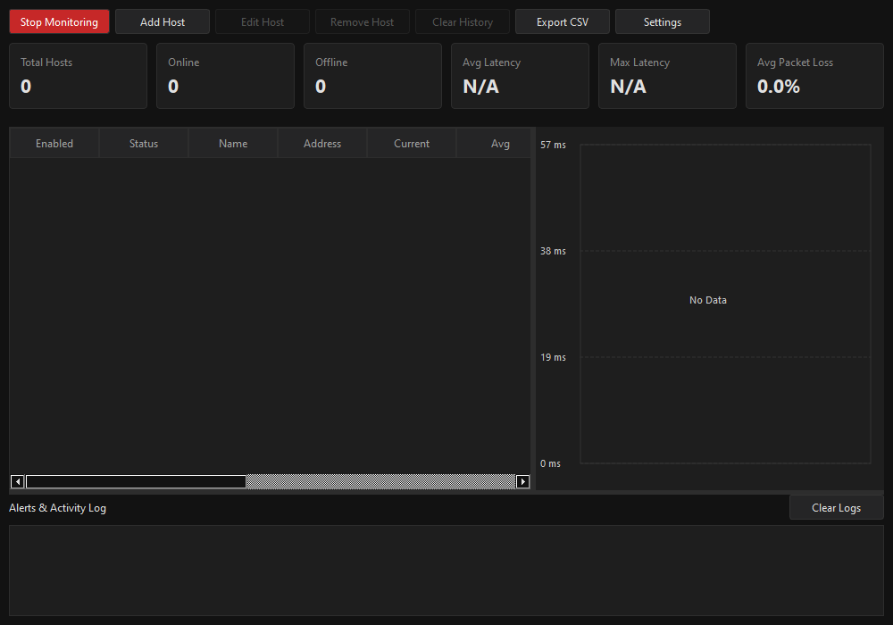
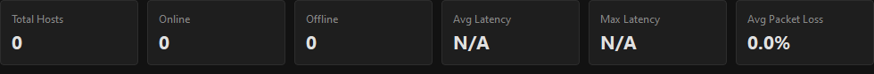
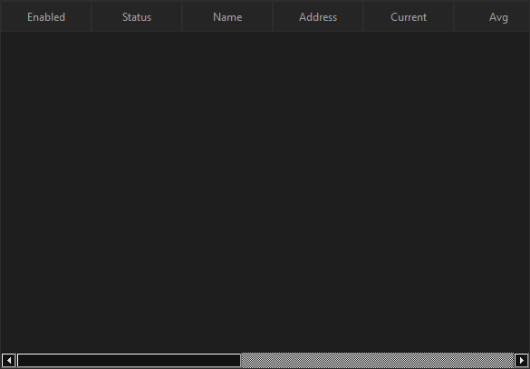
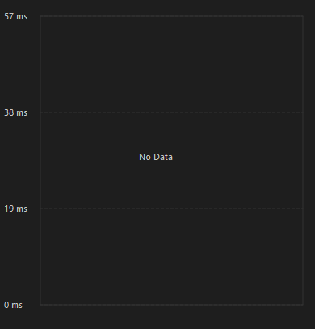

# Ping & Latency Monitor

A real-time desktop application written in Python and PySide6 to monitor the network latency, packet loss, and availability of multiple host destinations.

## Screenshots

### Main Window


### Dashboard


### Host Table


### Latency Graph


## Features

- **Host Management**: Add, edit, remove, and toggle monitoring on specific hostnames or IP addresses (IPv4/IPv6).
- **Concurrent Monitoring**: Uses thread pooling to execute host pings in parallel without blocking the user interface thread.
- **Real-Time Dashboard**: Displays aggregate metrics including total monitored hosts, online/offline count, average network latency, and average packet loss.
- **Latency Charting**: Renders dynamic real-time latency graphs and handles request timeout indicator visualizations.
- **Alert System**: Triggers visual notifications in the activity log when hosts become unreachable, recover, or cross latency/loss warning and critical thresholds.
- **Exporting**: Export host metrics and complete result history logs directly to CSV format.
- **Persistent Configuration**: Host lists and settings (default intervals, warning limits, UI dark/light themes) are automatically saved to the user environment.

## Requirements

- Python 3.8+
- PySide6

## Installation

1. Clone or download this repository.
2. Install the required dependencies:
   ```bash
   pip install -r requirements.txt
   ```

## Running the Application

Execute the entrypoint script:
```bash
python main.py
```

## Project Structure

```
monitor/
├── config.py (Configuration file management and settings serialization)
├── engine.py (Scheduling logic and concurrent network thread manager)
├── export.py (CSV compilation services)
├── models.py (Standardized data objects)
├── ping.py   (System subprocess invocation wrapper for ICMP requests)
└── ui/       (User interface widgets and controllers)
    ├── dashboard.py (Consolidated health card display)
    ├── dialogs.py   (Settings and host administration sheets)
    ├── graph.py     (Custom canvas paint routine for line graphs)
    ├── host_table.py (Dynamic table view and custom data model)
    └── main_window.py (Central coordinator widget and layout builder)
```

## Supported Platforms

- Windows 10 / 11
- macOS
- Linux

## License

This project is licensed under the MIT License.
