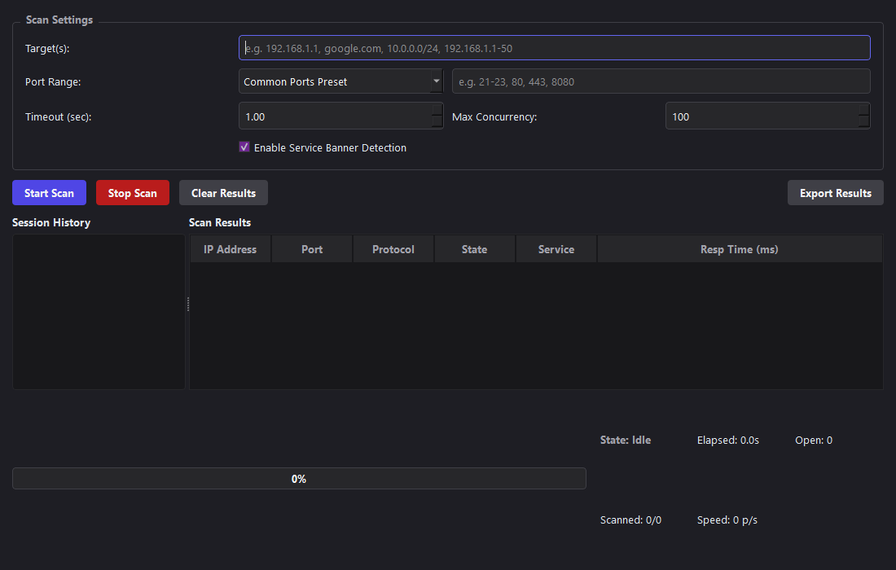

# Professional Network Port Scanner

A professional, high-performance desktop TCP Port Scanner application built using Python 3.11+ and PySide6. The application leverages `asyncio` for non-blocking concurrent scanning, providing a clean, responsive desktop interface with modern styling accents suited for system administrators and security professionals.

Developed by **XREFS0**.




## Features

- **Responsive PySide6 GUI**: Entirely non-blocking user interface using QThread workers running async event loops.
- **Asynchronous Scanner Engine**: High-performance TCP Connect scanner with configurable concurrency limits and connection timeouts.
- **Flexible Target Definitions**:
  - Single IPv4 address (e.g. `192.168.1.1`)
  - Domain Name resolution (e.g. `localhost`, `google.com`)
  - Subnet CIDR notation (e.g. `192.168.1.0/24`)
  - IP range formats (e.g. `192.168.1.1-192.168.1.50` or `192.168.1.1-50`)
- **Port Presets & Custom Configuration**:
  - Scan common ports preset (HTTP, SSH, HTTPS, database, etc.)
  - Full TCP range (1-65535)
  - Custom ranges and individual port listings (e.g., `21-23, 80, 443, 8080`)
- **Lightweight Service & Banner Grabbing**:
  - Safe banner grab attempts on open ports.
  - Silent failure/recovery mechanics to prevent slowing scans down.
- **Session Scan History**: Keep track of and quickly reload past scans from the current workspace session.
- **Advanced Export Utilities**: Export scanned results directly to **CSV** or **JSON** formats.

## Architecture

The project maintains a strict separation of concerns:
```
port_scanner/
├── app/
│   ├── main.py                # Entrypoint, logging & Qt setup
│   ├── config.py              # Port lists & timing configs
│   ├── models/
│   │   └── scan_result.py     # Data structures
│   ├── scanner/
│   │   └── engine.py          # Asynchronous connect scanner
│   ├── services/
│   │   └── service_resolver.py# Port-to-service mapping & banner grabbing
│   ├── networking/
│   │   └── resolver.py        # IP/Subnet target resolving
│   └── exporters/
│       ├── base.py            # Abstract exporter
│       ├── csv_exporter.py    # CSV export implementation
│       └── json_exporter.py   # JSON export implementation
├── ui/
│   └── windows/
│       └── main_window.py     # GUI layouts & event handlers
├── tests/                     # Unit test suite
├── requirements.txt           # Package dependencies
└── pyproject.toml             # Project metadata
```

## Installation

1. Make sure you have **Python 3.11+** installed.
2. Clone the repository.
3. Install the dependencies:
   ```bash
   pip install -r requirements.txt
   ```

## Usage

Start the port scanner by running:
```bash
python app/main.py
```

### Scan Modes

1. **Common Ports Preset**: Scans standard server ports (SSH, HTTP, HTTPS, DBs, etc.).
2. **Custom Range**: Enter comma-separated lists or ranges (e.g., `80, 443, 8000-8085`).
3. **Full TCP Range**: Scans all 65,535 TCP ports. (Use appropriate concurrency and timeout settings for optimal performance).

## Legal Notice

> [!IMPORTANT]
> This port scanner is an authorized network diagnostic and diagnostic tool. **Only use this software to scan systems that you own or have explicit written permission to test.** Unauthorised port scanning may violate local regulations or terms of service agreements. Use responsibly.
