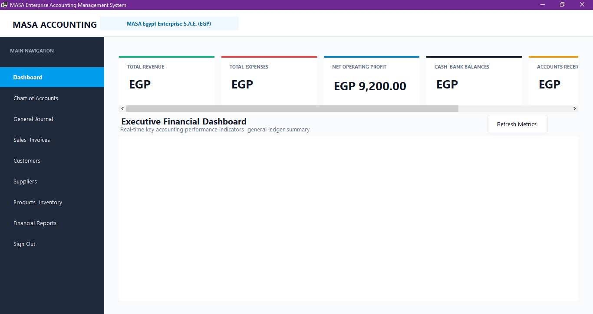
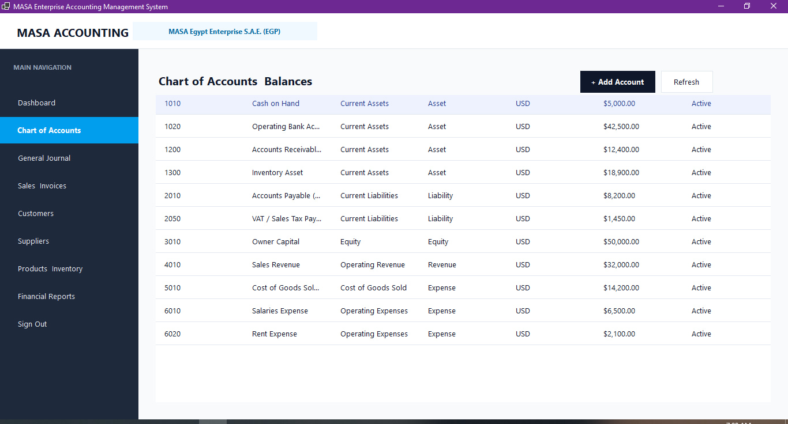
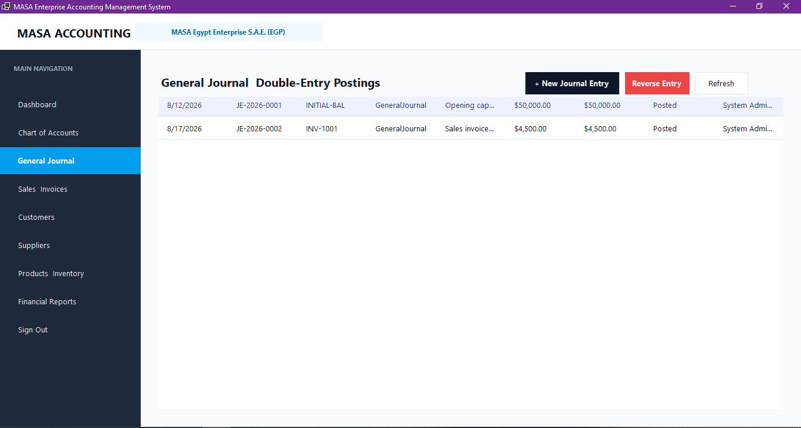
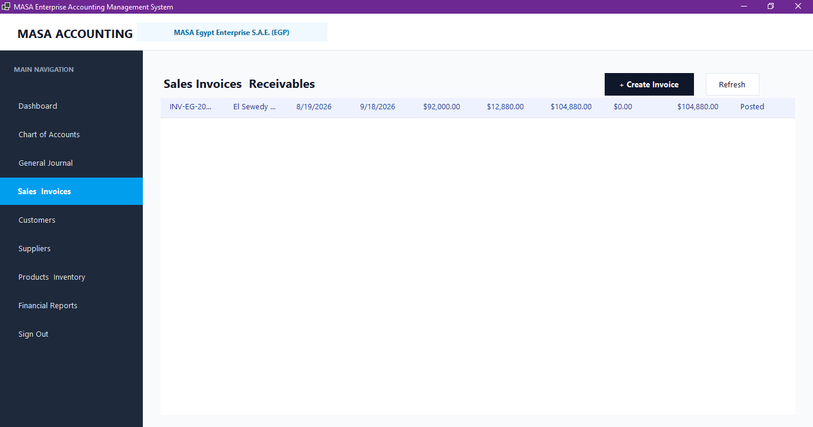
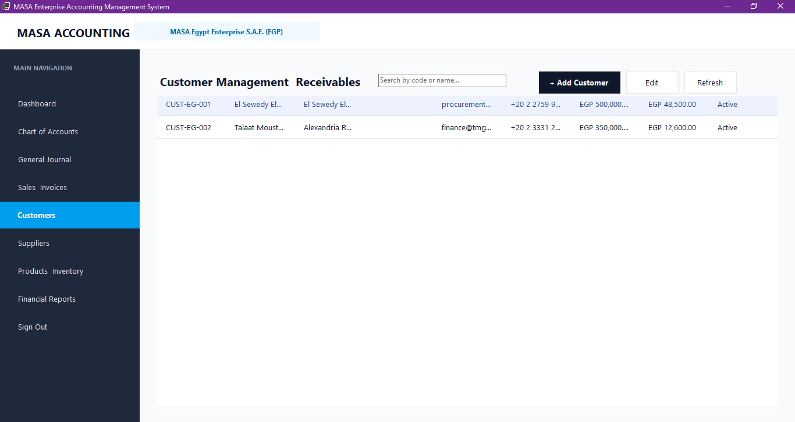
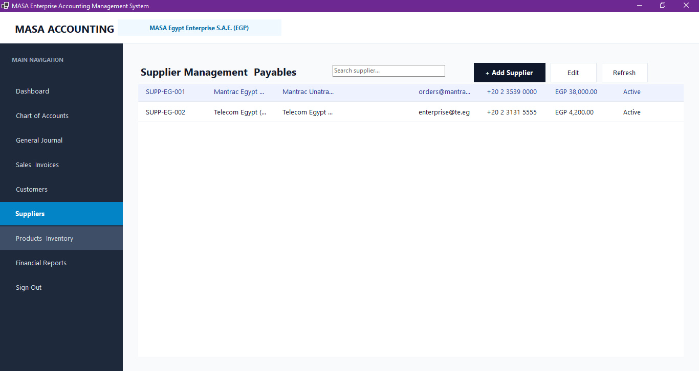
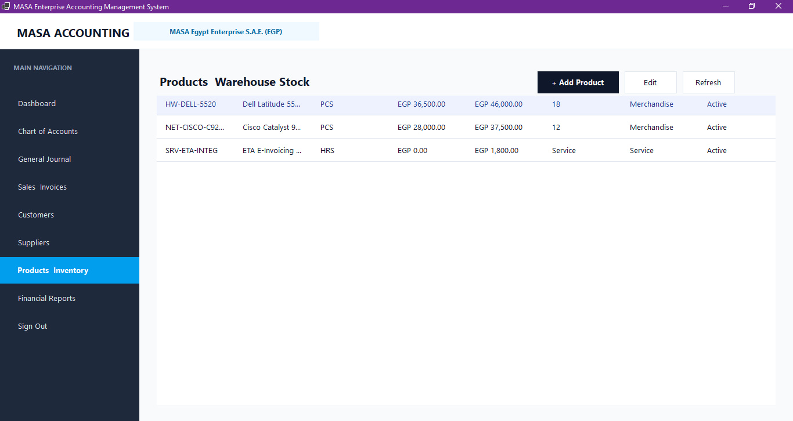
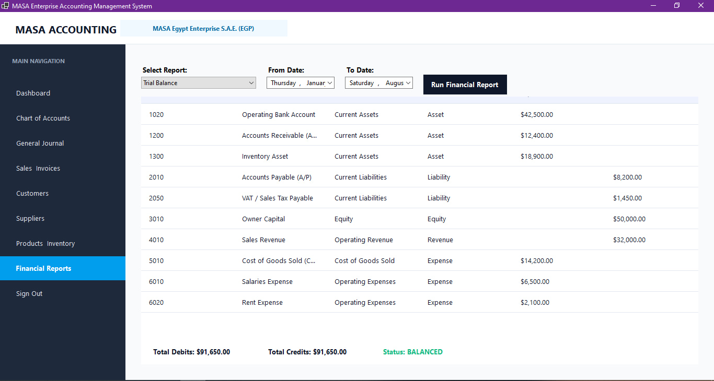
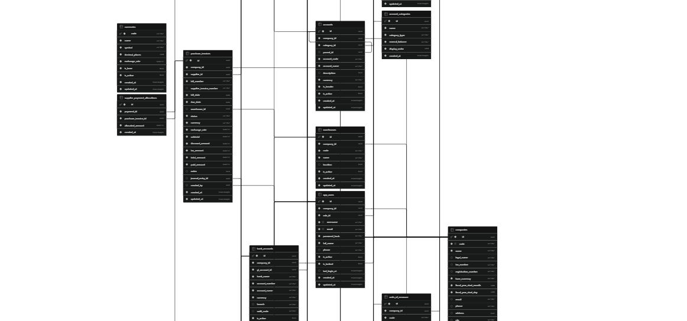

# MASA Accounting Management System

Audit-compliant double-entry accounting and enterprise financial management desktop system built with VB.NET, .NET 8, Windows Forms, Dapper, and PostgreSQL / Supabase.

Repository: [https://github.com/XREFS0/MASA-Accounting-Management-System](https://github.com/XREFS0/MASA-Accounting-Management-System)

---

## Application Screenshots

### Executive Financial Dashboard


### Chart of Accounts & Balances


### General Journal & Double-Entry Postings


### Sales Invoices & Receivables


### Customer Management


### Supplier Management


### Products & Inventory Valuation


### Financial Reports (Trial Balance & General Ledger)


### Database Entity-Relationship Architecture


---

## Technical Architecture

```
MASA Accounting Management System/
├── MasaAccounting.Core/           # Domain entities, business logic, validation rules, and data access
│   ├── Application/Services/      # Account, JournalEntry, SalesInvoice, PurchaseInvoice, Reports
│   ├── Domain/                    # Entity models and enums
│   └── Infrastructure/            # Database configuration provider and user session management
├── MasaAccounting.WinForms/       # Windows Forms presentation layer
│   ├── UI/Common/                 # UITheme color palette, typography, grid styling, and currency formatters
│   ├── UI/Controls/               # Module UserControls (Dashboard, Accounts, Journals, Invoices, Reports)
│   ├── UI/Forms/                  # Login dialog and Main application shell
│   └── Tools/                     # Automated screenshot capture utility
├── MasaAccounting.Tests/          # xUnit test suite for double-entry enforcement and calculation math
├── database/                      # SQL schema definitions and baseline seed datasets
│   ├── 01_schema.sql              # Relational schema (15 tables, constraints, foreign keys, indexes)
│   └── 02_seed_data.sql           # Chart of accounts, tax categories, and baseline seed data
├── ScreenShot/                    # High-resolution application preview screenshots
├── .env.example                   # Environment configuration template
├── LICENSE                        # MIT License
└── MasaAccounting.sln             # Visual Studio solution file
```

---

## Core Capabilities

1. **Strict Double-Entry Ledger Validation**:
   - Total debits must equal total credits with zero tolerance for imbalance.
   - Enforces a minimum of two transaction lines per entry with positive amounts.
   - Immutable posted journals with audit-compliant reversal mechanisms (`REV-...`).

2. **Hierarchical Chart of Accounts**:
   - Organized across standard financial categories: Current/Non-Current Assets, Current/Long-Term Liabilities, Equity, Operating Revenue, Cost of Goods Sold, and Operating Expenses.
   - Real-time account balances computed from posted general ledger transactions.

3. **Integrated Sales and Procurement Sub-Ledgers**:
   - Posting a sales invoice automatically generates balanced accounting journal lines (Debit Accounts Receivable, Credit Sales Revenue, Credit Tax Payable) and logs inventory movements.
   - Posting purchase bills updates accounts payable, logs inventory receipts, and accounts for input tax.

4. **Financial Reporting**:
   - **Trial Balance**: Complete debit and credit balance verification with automated balancing check.
   - **General Ledger**: Filterable account-level transaction statements with running balances.
   - **Executive Dashboard**: Key financial indicators for Revenue, Expenses, Net Operating Profit, Liquid Cash/Bank reserves, Accounts Receivable, and Accounts Payable.

---

## Prerequisites

- .NET 8.0 SDK (x64)
- Windows 10, Windows 11, or Windows Server (required for Windows Forms runtime)
- PostgreSQL 14+ or Supabase instance

---

## Configuration

1. Clone the repository:
   ```bash
   git clone https://github.com/XREFS0/MASA-Accounting-Management-System.git
   cd MASA-Accounting-Management-System
   ```

2. Copy `.env.example` to `.env` and fill in your connection details:
   ```bash
   copy .env.example .env
   ```

   ```env
   SUPABASE_URL=https://your-project.supabase.co
   SUPABASE_ANON_KEY=your-anon-key-here
   SUPABASE_DB_CONNECTION=Host=localhost;Port=5432;Database=masa_accounting;Username=postgres;Password=postgres;Pooling=true;
   DEFAULT_COMPANY_CODE=MASA-EG
   ```

   *Note: Never commit or share your `.env` file containing production credentials.*

3. Execute the database migration scripts:
   ```bash
   psql -h localhost -U postgres -d masa_accounting -f database/01_schema.sql
   psql -h localhost -U postgres -d masa_accounting -f database/02_seed_data.sql
   ```

---

## Build and Execution

### Build Solution
```bash
dotnet build MasaAccounting.sln
```

### Run Application
```bash
dotnet run --project MasaAccounting.WinForms/MasaAccounting.WinForms.vbproj
```

* **Default Administrator Login**: `admin` / `Admin@123`

---

## Running Unit Tests

Execute the automated test suite across all projects:

```bash
dotnet test MasaAccounting.sln
```

Test coverage includes:
- Double-entry validation rules (imbalance detection, single-line rejection, zero/negative amount checks).
- Sales and purchase invoice math (subtotal, tax, discount, line totals aggregation).
- Domain entity formatting and display helpers.

---

## License & Copyright

Copyright (c) 2026 **XREFS0**. All rights reserved.

Licensed under the [MIT License](LICENSE).
