# Attendance Management System (Desktop Edition)

Professional desktop attendance management and compliance system built in **VB.NET**, **Windows Forms**, and **SQLite** (`Microsoft.Data.Sqlite`).

Copyright (C) 2026 XREFS0. All rights reserved.

---

## Overview

The Attendance Management System provides an enterprise desktop solution for tracking employee working hours, shifts, leaves, official holidays, and compliance reporting. It is architected following Clean Architecture and SOLID principles, separating business calculation logic and data persistence from native Windows Forms presentation.

---

## Key Features

### 1. Attendance Terminal & Calculation Engine
- Live employee check-in and check-out terminal supporting manual code entry and barcode/RFID input.
- Automatic calculation of worked duration, late minutes against shift grace periods, early departures, and overtime thresholds.
- Support for attendance status classification: Present, Late, Absent, Half-Day, On-Leave, and Holiday.
- Manual attendance adjustments with reason logging and manager audit trails.

### 2. Employee Records Management
- Complete CRUD operations for employee master data.
- Association with departments, positions, and assigned work shifts.
- Egyptian phone format validation (`+20 10/11/12/15`) and email format validation.
- Filtering by department, employment status (Active, Inactive, Terminated, On Probation), and full-text search.
- One-click CSV data export.

### 3. Shift Configuration
- Dynamic shift definition (Morning, Evening, Night, and custom shifts).
- Configurable start time, end time, grace period in minutes, unpaid break deductions, and half-day thresholds.

### 4. Leave Management & Approval Flow
- Support for multiple leave categories (Annual, Sick, Casual, Maternity/Paternity, Unpaid).
- Request submission with automatic day count calculation.
- Administrative review workflow (Approve / Reject) with supervisor remarks.

### 5. Official Holiday Calendar
- Public holiday management with single-occurrence and recurring annual definitions.
- Automatic integration with attendance status resolution.

### 6. Comprehensive Reporting & Analytics
- Daily Attendance Summaries.
- Late and Tardy Incident Tracking with cumulative delay minutes.
- Overtime Man-Hours Analysis.
- Unexcused Absence Auditing.
- Monthly Employee Aggregate Reports.
- Export all reports to standard CSV format.

### 7. Security & Database Maintenance
- Role-based access control (Administrator, HR Manager, Supervisor, Employee).
- SHA-256 password hashing with cryptographic salt.
- Full immutable system audit logs for critical events and data changes.
- Hot database backup using non-locking SQLite `VACUUM INTO` and safe restore with automated safety checkpoints.

---

## Application Screenshots

All interfaces follow desktop-native design principles with high contrast readability, consistent Segoe UI typography, and zero icon fonts.

### Login Screen
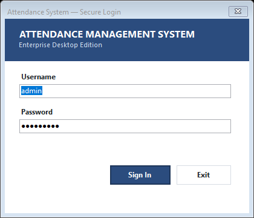

### Dashboard Overview
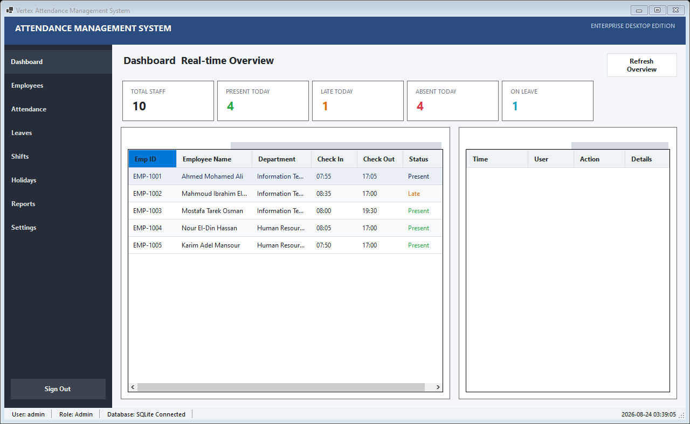

### Employee Directory
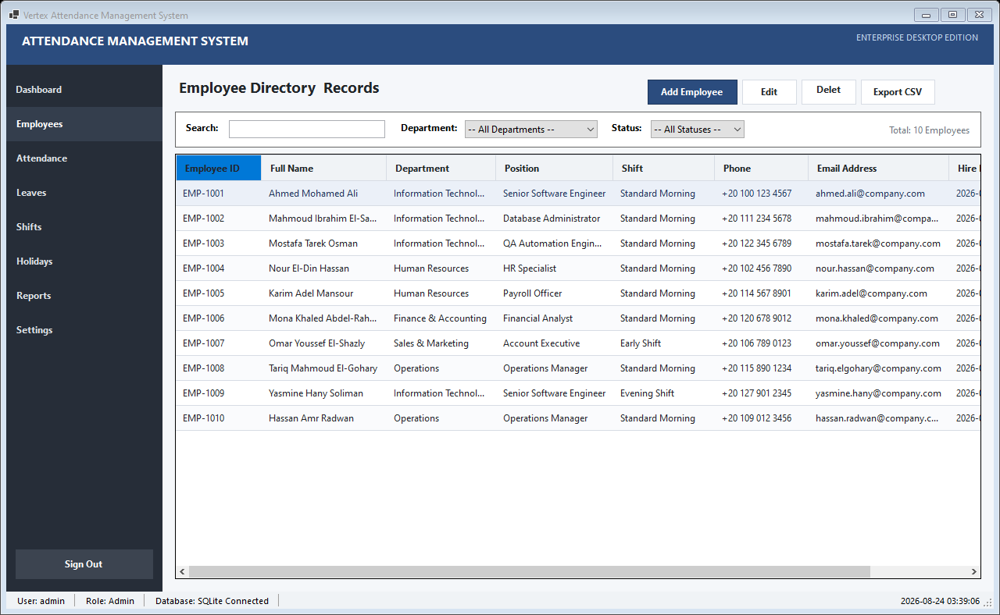

### Attendance Terminal & Logs
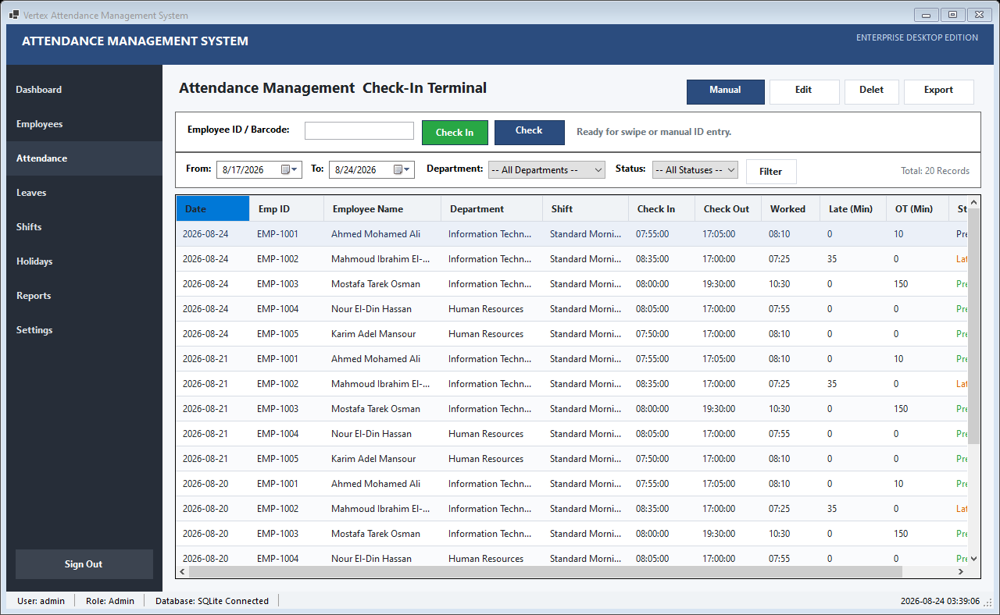

### Leave Workflow
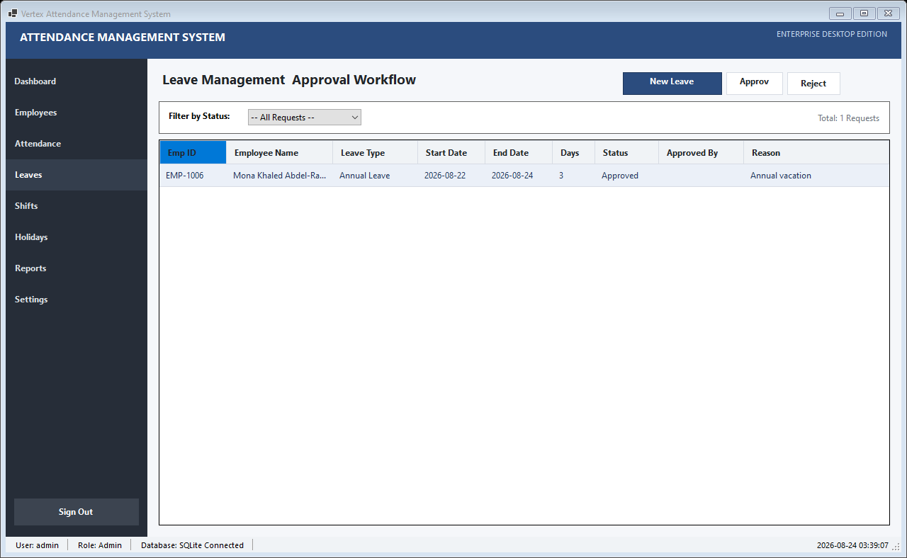

### Shift Management
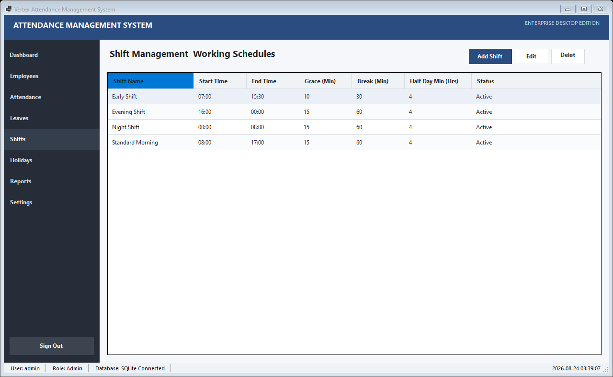

### Official Holidays
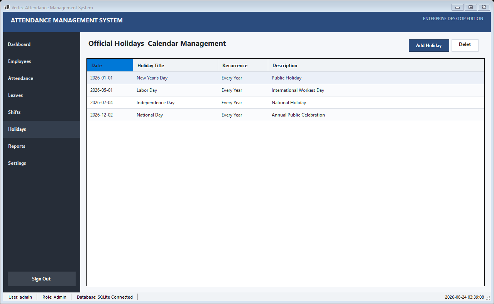

### Reports & Compliance Export
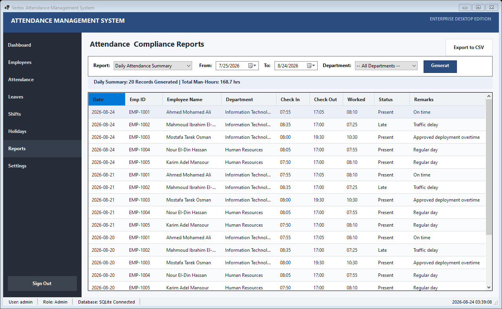

### System Settings & Backup Tools
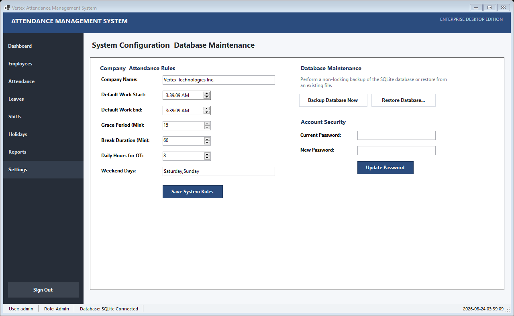

### Dialog Windows
| Add Employee | Manual Attendance Entry |
|---|---|
| 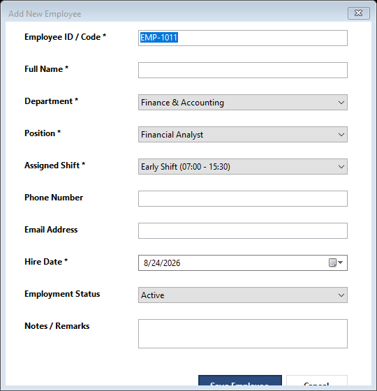 | 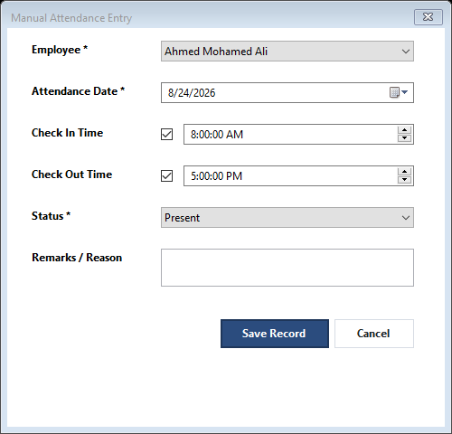 |

| Create Shift | Leave Request |
|---|---|
| 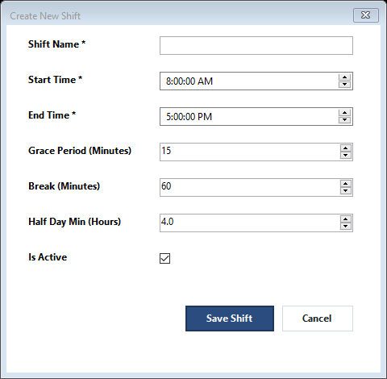 | 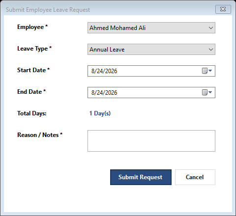 |

| Add Holiday |
|---|
| 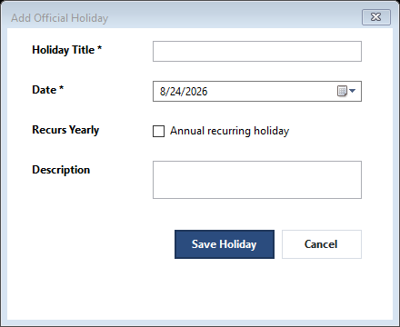 |

---

## Technical Specifications

- **Platform**: .NET 8.0 Windows Forms (`net8.0-windows`)
- **Language**: Visual Basic .NET (VB.NET)
- **Database**: SQLite 3 (`Microsoft.Data.Sqlite 10.0.11`)
- **Data Access**: Centralized ADO.NET with parameterized queries and explicit transactions
- **Target OS**: Windows 10 / 11 / Windows Server 2016+

---

## Project Structure

```text
AttendanceSystem/
├── Program.vb
├── AttendanceSystem.vbproj
├── Domain/
│   ├── Entities/
│   │   └── Entities.vb
│   └── Enums/
│       └── AppEnums.vb
├── Infrastructure/
│   ├── Database/
│   │   ├── DatabaseContext.vb
│   │   └── DatabaseInitializer.vb
│   ├── Repositories/
│   │   └── Repositories.vb
│   └── Security/
│       └── Security.vb
├── Application/
│   ├── Services/
│   │   └── Services.vb
│   └── DTOs/
│       └── DTOs.vb
├── Shared/
│   ├── Constants/
│   │   └── UITheme.vb
│   └── Utilities/
│       └── Utilities.vb
└── Presentation/
    ├── Controls/
    │   └── CommonControls.vb
    └── Views/
        ├── FormLogin.vb
        ├── FormMain.vb
        ├── DashboardView.vb
        ├── EmployeesView.vb
        ├── FormEmployeeEdit.vb
        ├── AttendanceView.vb
        ├── FormAttendanceEdit.vb
        ├── ShiftsView.vb
        ├── FormShiftEdit.vb
        ├── LeavesView.vb
        ├── FormLeaveRequest.vb
        ├── HolidaysView.vb
        ├── FormHolidayEdit.vb
        ├── ReportsView.vb
        └── SettingsView.vb
```

---

## Prerequisites & Installation

### Prerequisites
- [.NET 8.0 SDK](https://dotnet.microsoft.com/download/dotnet/8.0) or higher.
- Windows OS with Desktop Runtime installed.

### Build and Run

1. Clone or extract the repository into your workspace:
   ```bash
   git clone <repository-url>
   cd AttendanceSystem
   ```

2. Restore dependencies and build the solution:
   ```bash
   dotnet build
   ```

3. Launch the application:
   ```bash
   dotnet run
   ```

### Default Credentials
On first execution, SQLite automatically creates `attendance.db` and populates standard seed data:

- **Username**: `admin`
- **Password**: `Admin@123`
- **Role**: Administrator

---

## License & Attribution

Copyright (C) 2026 **XREFS0**. All rights reserved.
Unauthorized copying, modification, or distribution of this software is strictly prohibited.
