# Customer Relationship Manager (Enterprise CRM)

A modular Windows desktop Customer Relationship Management system developed with .NET 8, Windows Forms, and SQLite.

Repository: https://github.com/XREFS0/Customer-Relationship-Manager

---

## Overview

Customer Relationship Manager is an offline-first management suite built for operations and sales teams. It provides full customer lifecycle management, deal pipeline tracking, task scheduling, communication auditing, data analytics, and local database backup utilities.

---

## Application Screenshots

### Main Interface & Analytics

| Dashboard Overview | Sales Pipeline |
| :---: | :---: |
| 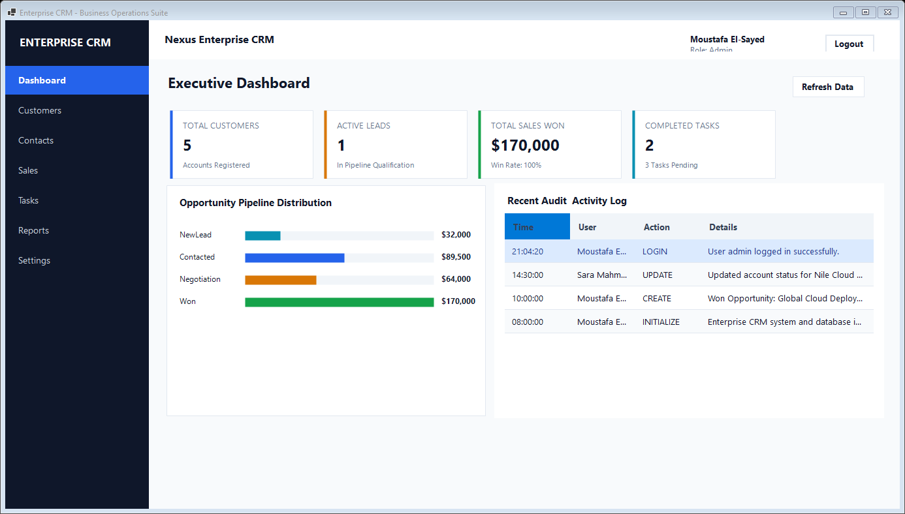 | 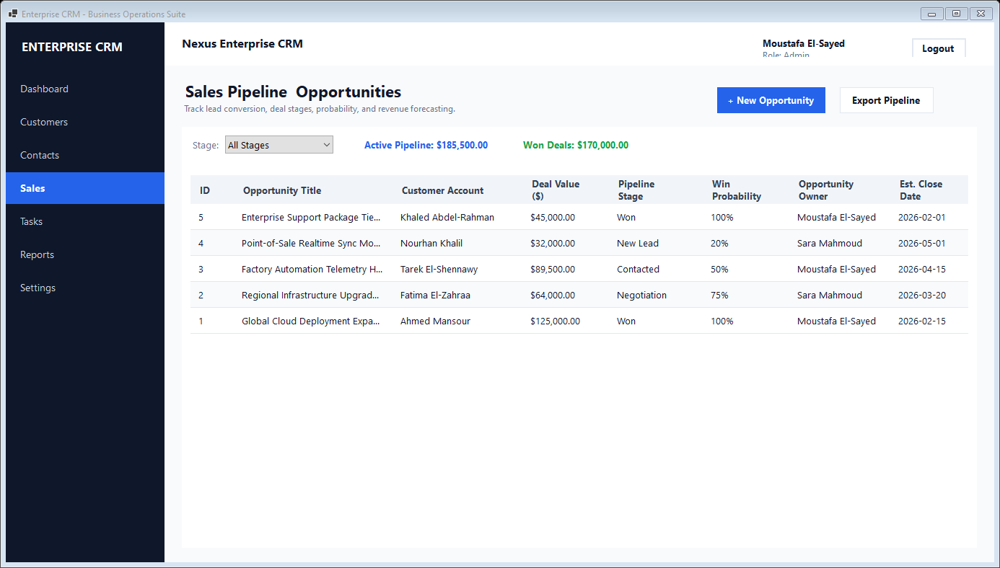 |

| Customer Directory | Reports & Business Intelligence |
| :---: | :---: |
| 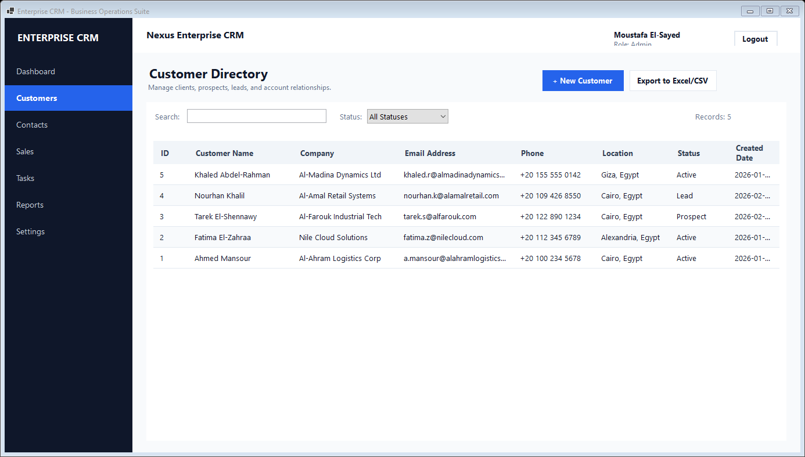 | 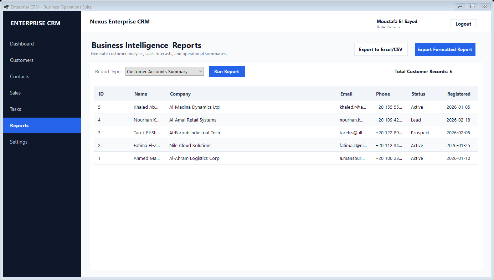 |

### Operations & Management

| Communication & Interaction History | Task Execution & Backlog |
| :---: | :---: |
| 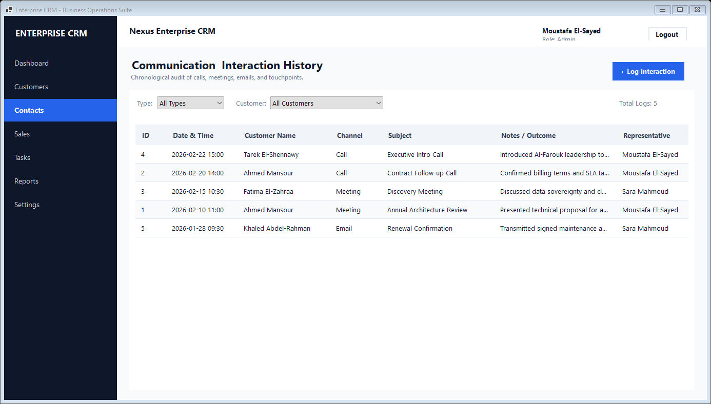 | 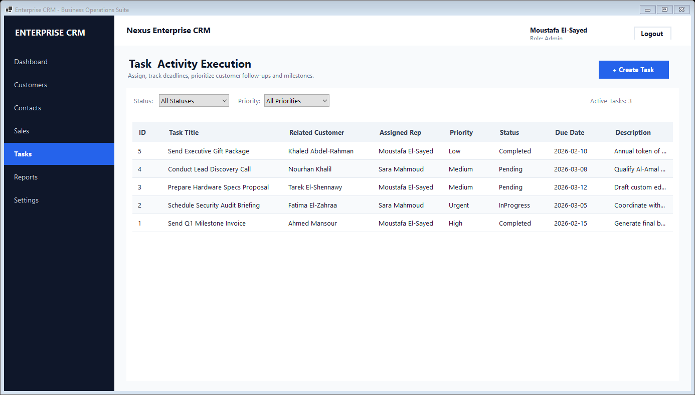 |

| System Configuration & Maintenance | Authentication |
| :---: | :---: |
| 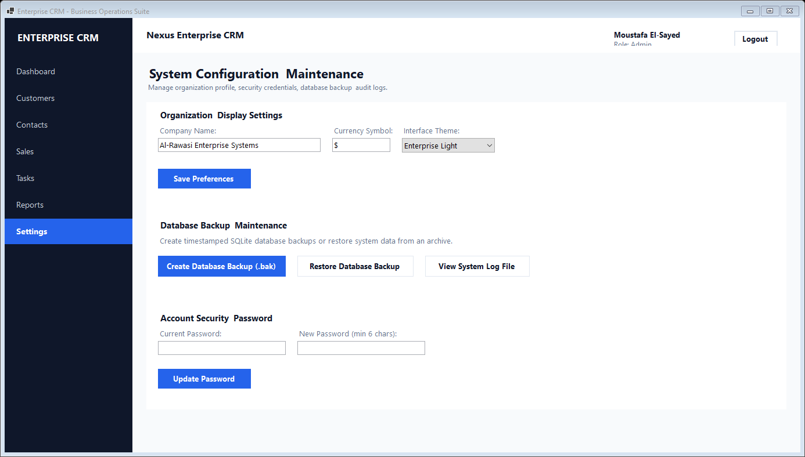 | 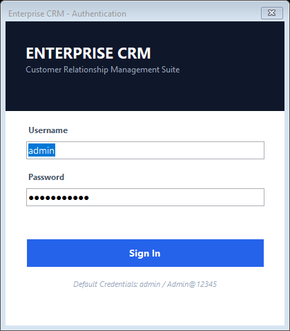 |

### Modal Dialogs & Dark Theme

| Customer Profile Dialog | Sales Opportunity Dialog |
| :---: | :---: |
| 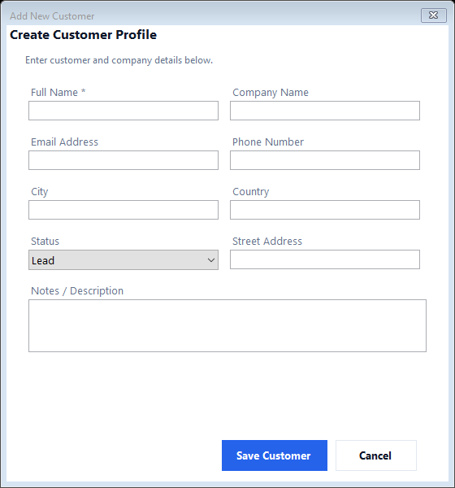 | 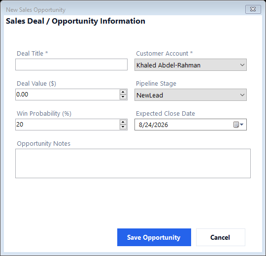 |

| Dashboard Dark Mode | Sales Pipeline Dark Mode |
| :---: | :---: |
| 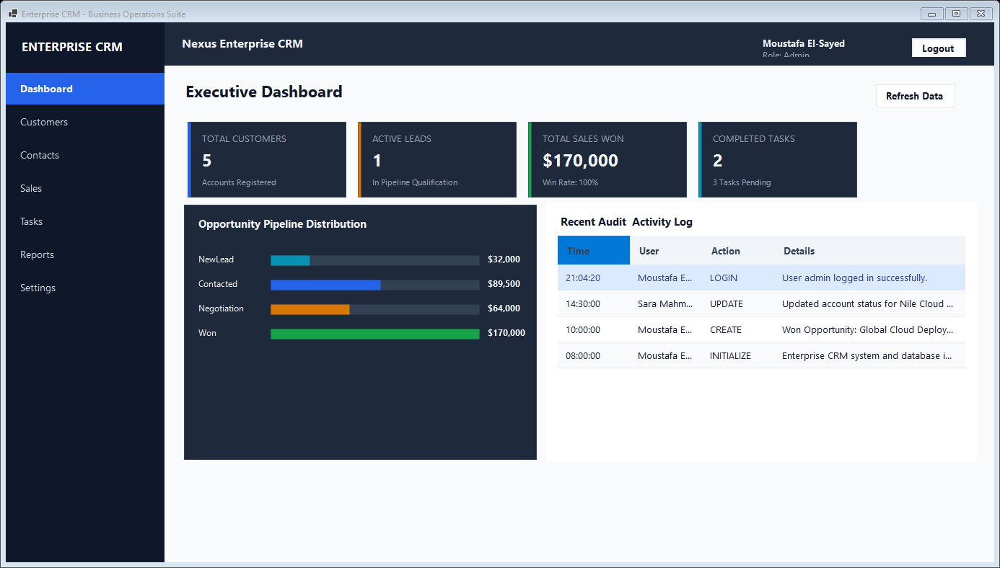 | 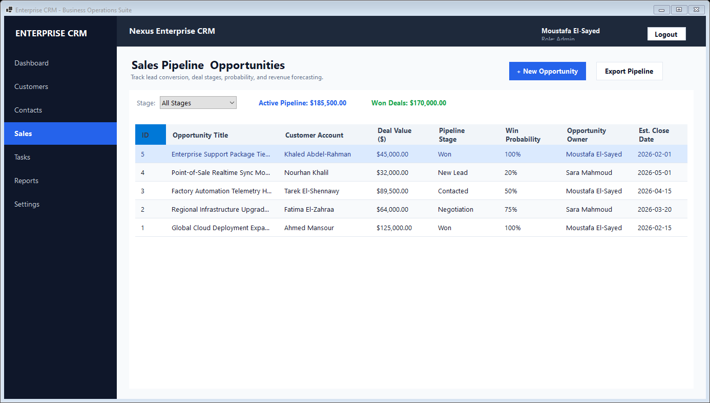 |

---

## Core Capabilities

- **Executive Dashboard**: Real-time sales metrics, opportunity stage breakdown charts, active leads count, and live activity audit streams.
- **Customer Directory**: Customer profiles, search and filtering by lifecycle status, full 360-degree customer detail views, and CSV export.
- **Interaction History**: Chronological logging of calls, meetings, emails, and notes linked to customer records.
- **Sales Pipeline**: Deal tracking across stages (New Lead, Contacted, Negotiation, Won, Lost), win probability calculation, and revenue forecasting.
- **Task & Activity Execution**: Priority-based task management with due dates, assignment tracking, and completion status.
- **Reporting & Business Intelligence**: Summary reports with data grid views, CSV exports, and styled standalone HTML export for reporting.
- **Security & Data Maintenance**: Role-based access (Admin / Employee), password hashing with PBKDF2/SHA256 and unique salt, transactional SQLite database backup and restoration.
- **Theme Support**: Built-in Light and Dark themes.

---

## System Architecture

```
EnterpriseCRM/
├── Data/
│   ├── Repositories/       # Data Access Objects (CRUD per entity)
│   ├── DatabaseContext.vb  # SQLite connection factory & WAL configuration
│   └── DbInitializer.vb    # Schema creation & initial seed data
├── Models/
│   ├── Entities.vb         # Domain entities (User, Customer, SaleOpportunity, etc.)
│   └── Enums.vb            # Domain enumerations (CustomerStatus, PipelineStage, etc.)
├── Services/
│   ├── AppLogger.vb        # File-based logging and exception auditing
│   ├── SecurityService.vb  # PBKDF2 password hashing & verification
│   └── Services.vb         # Application business services (Auth, Customer, Sales, Reports)
├── UI/
│   ├── Controls/           # Custom reusable controls (KPI cards, bar chart)
│   ├── Forms/              # Dialogs (Login, Customer, Sale, Task, Detail views)
│   ├── Theme/              # Theme palette management (Light & Dark modes)
│   └── Views/              # Modular user control pages for the main viewport
├── ScreenShot/             # Application screenshots
└── Program.vb              # Application bootstrap & entry point
```

---

## Technical Specifications

- **Target Framework**: .NET 8.0 Windows (`net8.0-windows`)
- **UI Platform**: Windows Forms (WinForms)
- **Database Engine**: SQLite via `Microsoft.Data.Sqlite`
- **Architecture Pattern**: Layered Repository & Service Architecture

---

## Requirements

- Windows 10 or Windows 11 (64-bit)
- .NET 8.0 SDK or Desktop Runtime

---

## Installation & Execution

### 1. Clone Repository
```bash
git clone https://github.com/XREFS0/Customer-Relationship-Manager.git
cd Customer-Relationship-Manager
```

### 2. Build Solution
```bash
dotnet build
```

### 3. Run Application
```bash
dotnet run
```

---

## Default Access Credentials

On first run, the SQLite database is automatically generated with initial seed accounts:

| Username | Password | Role |
| :--- | :--- | :--- |
| `admin` | `Admin@12345` | Administrator |
| `sara` | `Employee@123` | Employee |

Credentials and system settings can be updated directly within the **Settings** view.

---

## License & Copyright

Copyright (c) 2026 XREFS0. All rights reserved.

Licensed under the [MIT License](LICENSE).
