# Desktop Backup Tool

An enterprise-grade desktop backup utility built with **VB.NET**, **Windows Forms** on **.NET 8**, and **SQLite**.

Designed with clean layered architecture, AES-256 PBKDF2 encryption, streaming ZIP compression, SHA-256 integrity verification, incremental change detection, non-blocking background scheduling, and automated retention management.

All rights reserved to **XREFS0**.

---

## User Interface & Screenshots

### Dashboard Overview
Real-time statistics, engine status banner, quick actions, and recent backup runs log.

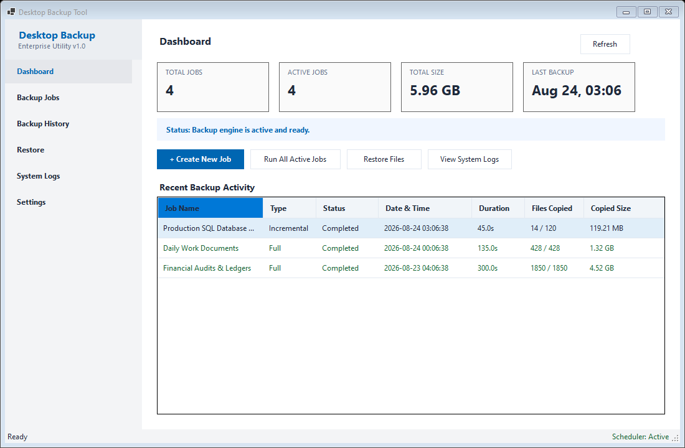

### Backup Jobs Management
Configured backup jobs table with operational status, schedule details, and action controls.

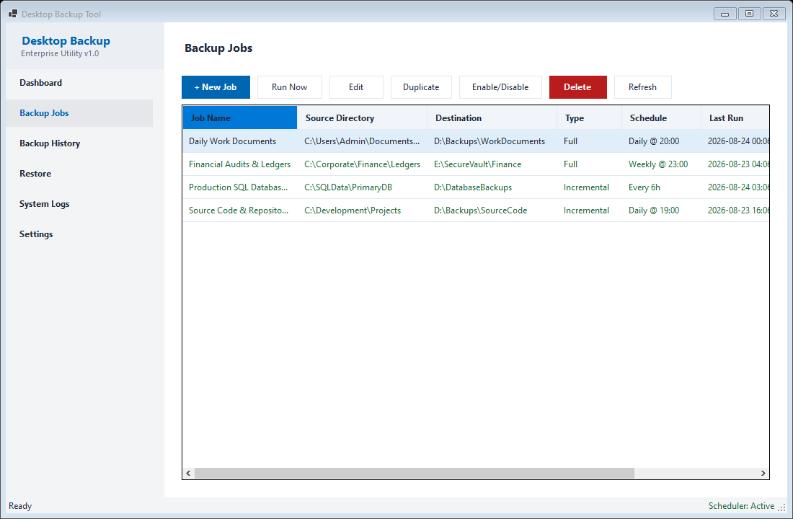

### Job Configuration Dialog

#### General Settings
Definition of job name, source path, target destination, backup strategy, and activation status.

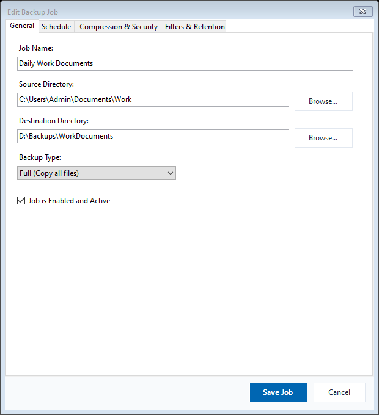

#### Scheduling Options
Flexible scheduling supporting Manual execution, Daily triggers, Weekly selection, or Hourly recurring intervals.

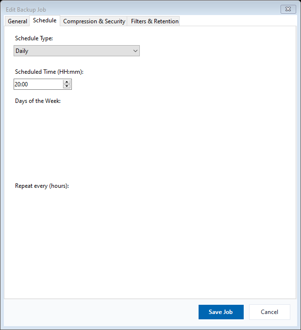

#### Compression and AES-256 Encryption
Configurable ZIP compression levels and AES-256 password protection with PBKDF2 key derivation.

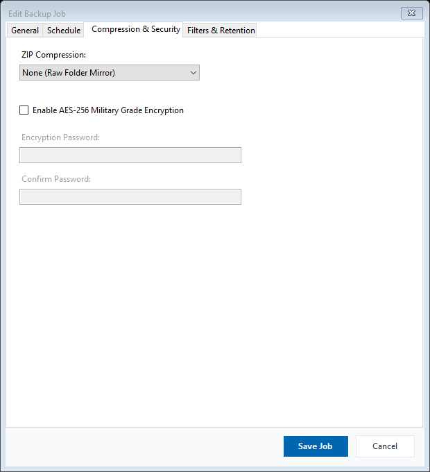

#### Filters, Exclusions, and Retention Policy
Directory exclusions, file extension filters, pattern matching, and automated retention limits.

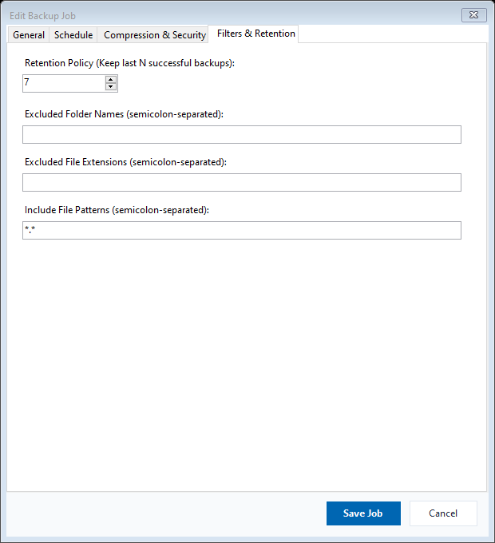

### Backup Execution & Progress
Real-time progress reporting displaying file counters, byte volume, transfer speed, and cancellation support.

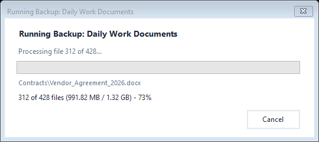

### Backup History & File Manifest
Execution audit log with duration, volume transferred, destination path, and file-level SHA-256 manifest.

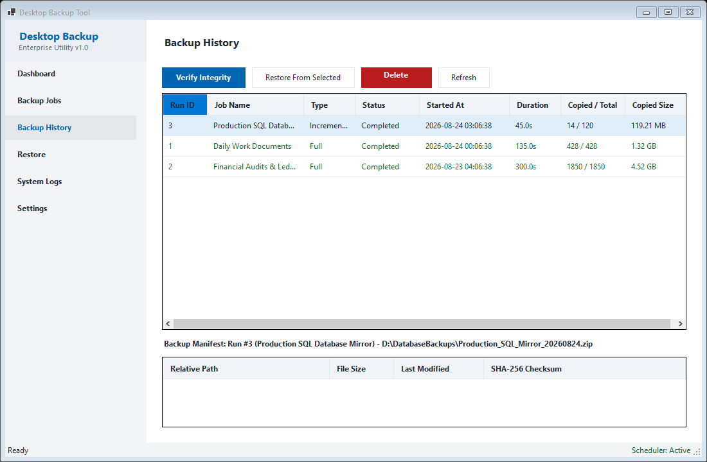

### Integrity Verification Report
Automated SHA-256 checksum and file size validation against stored database manifests.

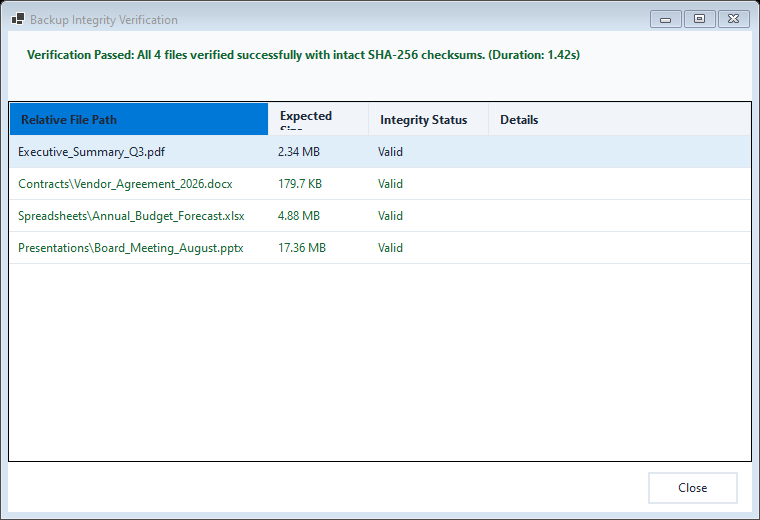

### Restore Wizard
Three-step recovery workflow allowing selective file extraction, target folder selection, and overwrite conflict resolution.

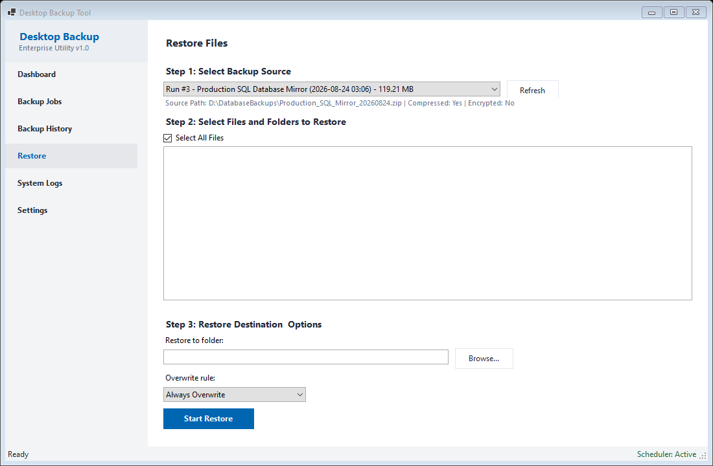

### System Diagnostics & Logs
Filterable audit log by severity level (Information, Warning, Error) with detailed exception stack traces.

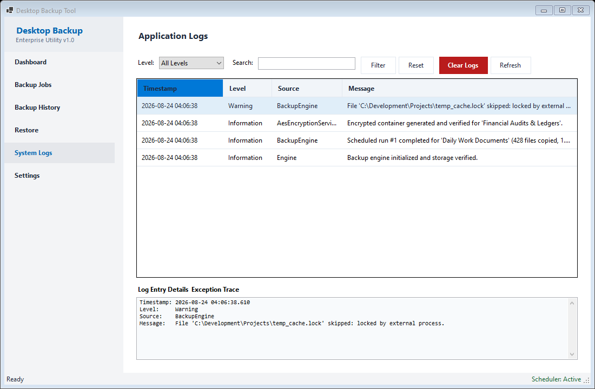

### Application Settings & Database Maintenance
Database size metrics, SQLite VACUUM optimization, default configuration values, and environment runtime details.

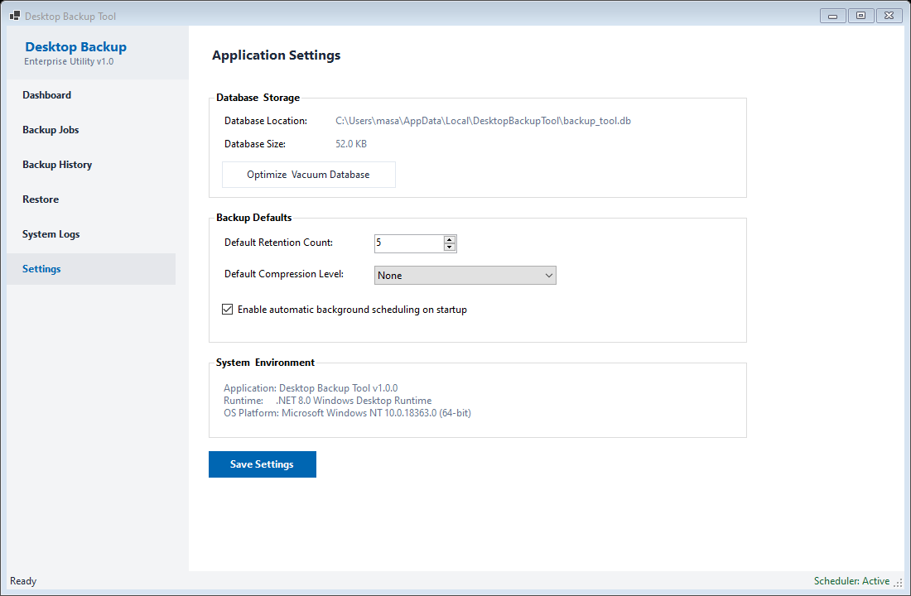

---

## Technical Specifications & Features

- **Backup Strategies**:
  - **Full Backup**: Comprehensive snapshot of source directory structures with file-level hash tracking.
  - **Incremental Backup**: Metadata-based delta analysis comparing file size, modification timestamps, and cached SHA-256 hashes to transfer only altered data.
- **Cryptography & Security**:
  - AES-256 in CBC mode with PKCS7 padding.
  - Key derivation powered by PBKDF2 (`Rfc2898DeriveBytes`) utilizing SHA-256 and 100,000 iterations.
  - Unique cryptographic salt and initialization vector (IV) generated per archive.
  - Pre-flight header token verification for secure password validation before extraction.
- **Archive Compression**:
  - Streaming ZIP archive generation preserving relative path hierarchies.
  - Fast and Optimal compression profiles designed for minimal memory overhead.
- **Verification Engine**:
  - Independent SHA-256 checksum evaluation comparing physical disk files or ZIP archive contents against SQLite records.
  - Detection of missing, altered, or damaged files with detailed status reporting.
- **Recovery Engine**:
  - Granular selection of target files and directories from previous backup runs.
  - Configurable overwrite handling (`Always Overwrite`, `Skip Existing`, `Overwrite If Newer`).
- **Retention Management**:
  - Configurable retention limits per job.
  - Safe pruning executed only after confirming the successful completion of the newest backup run.
- **Scheduling Architecture**:
  - Non-blocking background scheduler running on asynchronous timers.
  - Supports Manual, Daily, Weekly, and Interval execution schedules without freezing the UI thread.
- **Data Persistence**:
  - High-performance SQLite database engine using `Microsoft.Data.Sqlite`.
  - Write-Ahead Logging (WAL) mode enabled for high concurrency and transaction safety.
  - Parameterized queries across all database operations.

---

## Architecture & Solution Layout

The solution follows a strict layered architecture with clear separation of responsibilities:

```text
DesktopBackupTool
├── src
│   ├── DesktopBackupTool.Domain
│   │   ├── Entities          # BackupJob, BackupRun, BackupFileRecord, AppLog, AppSettings
│   │   ├── Enums             # BackupType, BackupStatus, ScheduleType, LogLevel, OverwriteMode
│   │   └── Interfaces        # Repository contracts
│   │
│   ├── DesktopBackupTool.Application
│   │   ├── DTOs              # Progress reports, verification models, validation models
│   │   ├── Interfaces        # Service abstractions, engine contracts, validators
│   │   ├── Services          # BackupJobService
│   │   └── Validators        # JobValidator
│   │
│   ├── DesktopBackupTool.Infrastructure
│   │   ├── Database          # SQLite DatabaseContext and schema initializers
│   │   ├── Repositories      # JobRepository, RunRepository, FileRepository, LogRepository, SettingsRepository
│   │   ├── Backup            # BackupEngine, RestoreEngine, VerificationService, RetentionService
│   │   ├── Compression       # ZipCompressionService
│   │   ├── Encryption        # AesEncryptionService
│   │   ├── FileSystem        # Sha256ChecksumService
│   │   └── Scheduling        # WindowsSchedulerService
│   │
│   └── DesktopBackupTool.Presentation
│       ├── Forms             # MainForm
│       ├── Controls          # DashboardView, BackupJobsView, BackupHistoryView, RestoreView, LogsView, SettingsView
│       ├── Dialogs           # JobEditorDialog, ProgressDialog, VerificationReportDialog
│       ├── UI                # UITheme, typography, palette definitions
│       └── AppContainer.vb   # Dependency injection composition root
│
└── tests
    └── DesktopBackupTool.Tests
        ├── ChecksumTests.vb
        ├── EncryptionTests.vb
        ├── CompressionTests.vb
        ├── ValidationTests.vb
        ├── DatabaseTests.vb
        ├── BackupEngineTests.vb
        ├── AdvancedBackupEngineTests.vb
        ├── RetentionTests.vb
        ├── RestoreEngineTests.vb
        └── SchedulerTests.vb
```

---

## Requirements

- **Operating System**: Windows 10, Windows 11, or Windows Server 2016+ (x64 / x86)
- **Runtime Environment**: .NET 8.0 SDK or .NET 8.0 Desktop Runtime

---

## Building and Testing

### Build Solution
```powershell
dotnet build DesktopBackupTool.sln
```

### Run Test Suite
```powershell
dotnet test
```

### Launch Application
```powershell
dotnet run --project src/DesktopBackupTool.Presentation/DesktopBackupTool.Presentation.vbproj
```

---

## License & Copyright

Copyright (c) 2026 **XREFS0**.

This project is licensed under the MIT License. See the [LICENSE](LICENSE) file for complete details.
