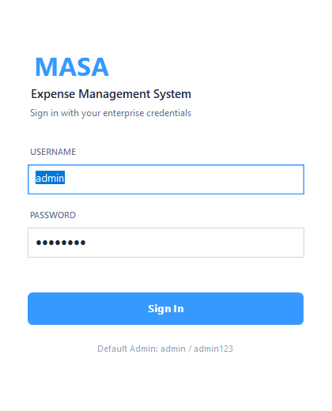
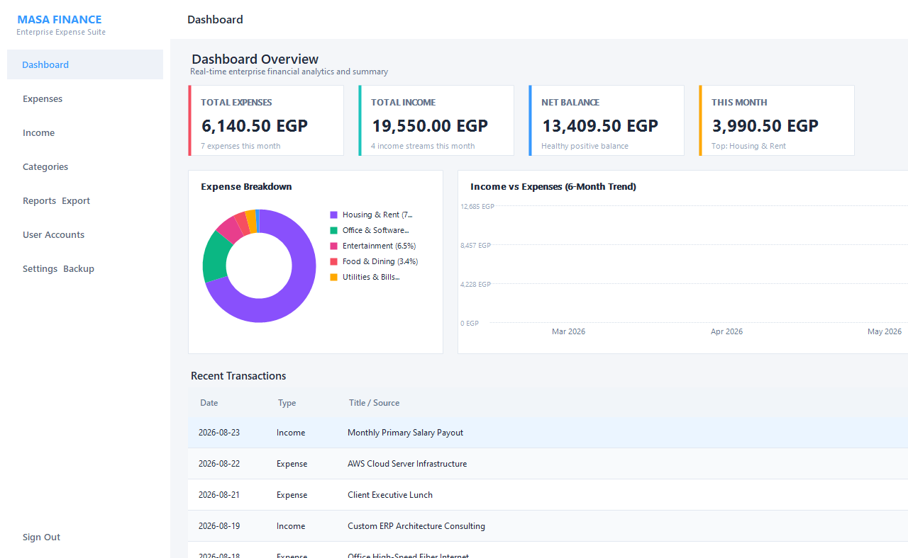
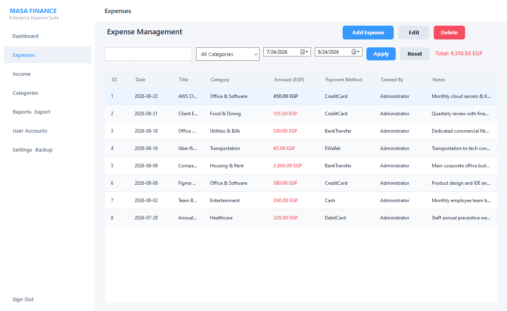
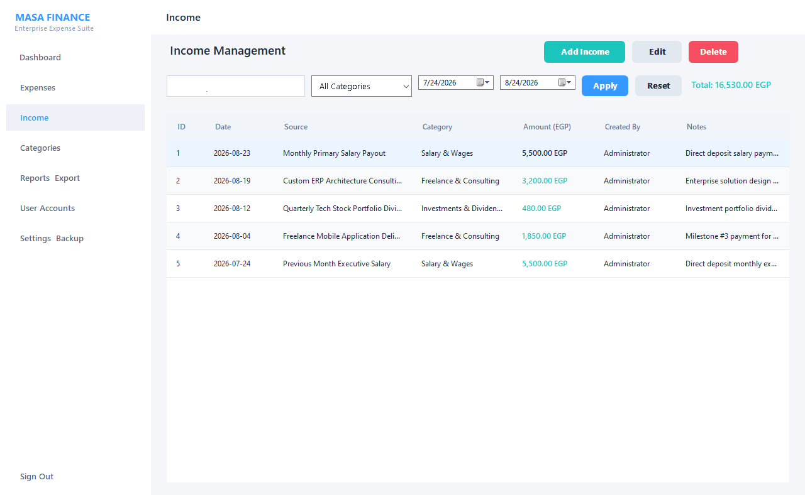
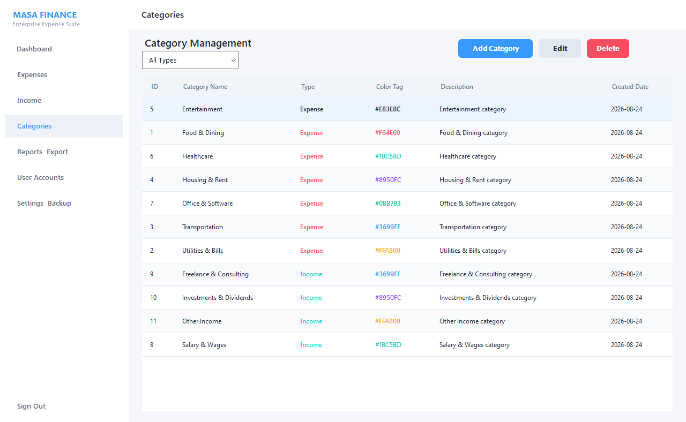
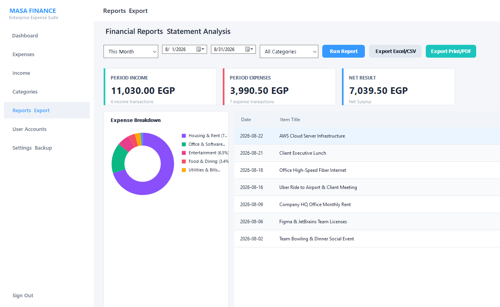
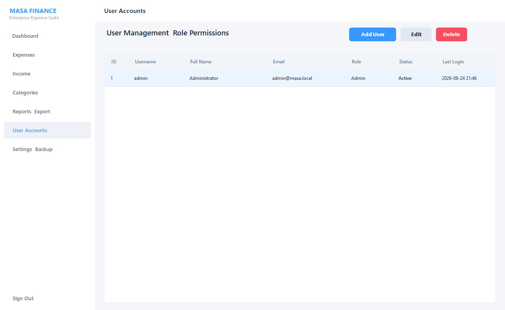
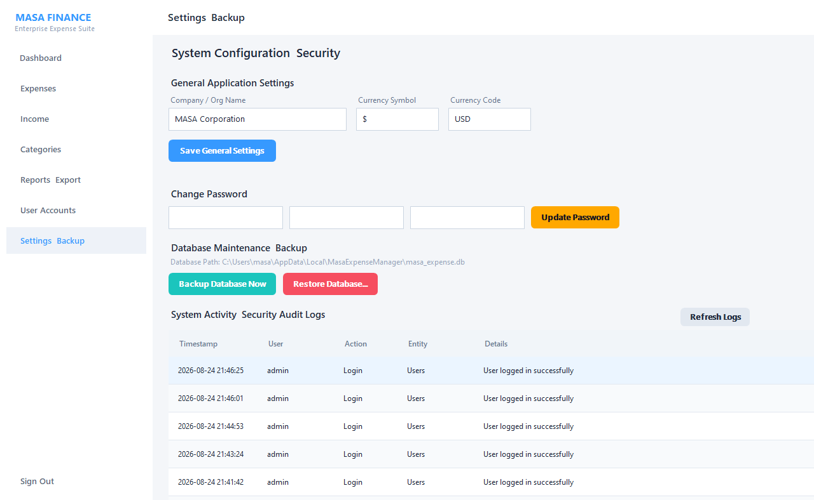

# Expense Management System

A desktop financial accounting and expense management application developed in VB.NET (.NET 8 Windows Forms) backed by SQLite. Designed with a layered architecture, a modern light theme, custom GDI+ reporting charts, and local data persistence.

Repository: [https://github.com/XREFS0/Expense-Management-System](https://github.com/XREFS0/Expense-Management-System)

---

## Screenshots

### 1. Authentication


### 2. Dashboard & Analytics


### 3. Expense Management


### 4. Income Tracking


### 5. Category Management


### 6. Reports & Export (CSV / PDF)


### 7. User Accounts & Access Control


### 8. System Settings, Backup & Audit Logs


---

## Features

- **Authentication & Security**: Local authentication with salted SHA-256 password hashing and role-based permissions (Admin, Manager, User).
- **Dashboard**: KPI metric cards, category breakdown donut chart, and 6-month comparative trend bar chart.
- **Expense Tracking**: Add, edit, delete, search, and filter expenses by date, category, and payment method.
- **Income Tracking**: Manage multiple income streams with search and date range filters.
- **Category Hierarchy**: Custom color tags and referential deletion safeguards.
- **Financial Reports**: Multi-period statements with instant CSV export and printable HTML/PDF output.
- **Database Maintenance**: One-click SQLite database backup and restoration engine.
- **Audit Trail**: Action logging for account logins, record creation, updates, and deletions.

---

## Architecture Overview

```
Expense-Management-System/
├── Models/                     # Domain Entities, Enums & View Models
│   ├── Entities.vb
│   └── Enums.vb
├── DataAccess/                 # SQLite Repositories & Connection Context
│   ├── DatabaseContext.vb
│   ├── DatabaseInitializer.vb
│   ├── UserRepository.vb
│   ├── ExpenseRepository.vb
│   ├── IncomeRepository.vb
│   ├── CategoryRepository.vb
│   ├── TransactionRepository.vb
│   ├── SettingsRepository.vb
│   └── AuditLogRepository.vb
├── Business/                   # Business Services & Validation Logic
│   ├── Security/
│   │   └── PasswordHasher.vb
│   └── Services/
│       ├── AuthService.vb
│       ├── UserService.vb
│       ├── ExpenseService.vb
│       ├── IncomeService.vb
│       ├── CategoryService.vb
│       ├── DashboardService.vb
│       ├── ReportService.vb
│       └── BackupRestoreService.vb
├── UI/                         # Presentation Layer
│   ├── Theme/
│   │   └── ThemeColors.vb
│   ├── Controls/
│   │   ├── CustomControls.vb
│   │   ├── ChartControls.vb
│   │   ├── ModernDataControls.vb
│   │   └── CustomMessageBox.vb
│   ├── Forms/
│   │   ├── LoginForm.vb
│   │   └── MainForm.vb
│   └── Views/
│       ├── DashboardView.vb
│       ├── ExpensesView.vb
│       ├── IncomeView.vb
│       ├── CategoriesView.vb
│       ├── ReportsView.vb
│       ├── UsersView.vb
│       └── SettingsView.vb
├── ScreenShot/                 # Application Screenshots
├── Program.vb                  # Application Entry Point
└── MasaExpenseManager.vbproj   # Project Configuration (.NET 8 WinForms)
```

---

## Requirements

- Windows 10 / 11 / Windows Server
- [.NET 8.0 Desktop Runtime](https://dotnet.microsoft.com/download/dotnet/8.0) or .NET 8.0 SDK

---

## Building and Running

### Clone Repository
```bash
git clone https://github.com/XREFS0/Expense-Management-System.git
cd Expense-Management-System
```

### Build Solution
```bash
dotnet build -c Release
```

### Run Application
```bash
dotnet run
```

---

## Default Credentials

On first run, the SQLite database is created and initialized automatically with the following accounts:

| Full Name | Username | Password | Role |
|---|---|---|---|
| Ahmed Hassan | `admin` | `admin123` | Admin |
| Mahmoud Ali | `mahmoud.ali` | `manager123` | Manager |
| Tarek Ibrahim | `tarek.ibrahim` | `user123` | User |
| Sarah El-Masry | `sarah.elmasry` | `user123` | User |

---

## License

All rights reserved. Released under the MIT License. See [LICENSE](LICENSE) for details.
