# MASA Invoice & Billing Management System

[](https://github.com/XREFS0/MASA-Invoice-Generator)
[](https://dotnet.microsoft.com/)
[](https://learn.microsoft.com/en-us/dotnet/visual-basic/)
[](https://learn.microsoft.com/en-us/dotnet/desktop/winforms/)
[](https://www.sqlite.org/)
[](LICENSE)

A standalone desktop invoice, billing, client management, and financial reporting system engineered in **VB.NET (.NET 8)** with **Windows Forms**, **SQLite (`Microsoft.Data.Sqlite`)**, **Dapper**, **Microsoft.Extensions.DependencyInjection**, and **QuestPDF**.

Repository: [https://github.com/XREFS0/MASA-Invoice-Generator](https://github.com/XREFS0/MASA-Invoice-Generator)

---

## Screenshots

### 1. Executive Dashboard & Overview
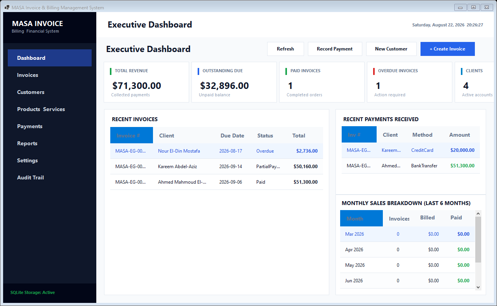

---

### 2. Invoices Management & Lifecycle
| Invoice Registry | Invoice Creator & Line Items Editor |
| :---: | :---: |
| 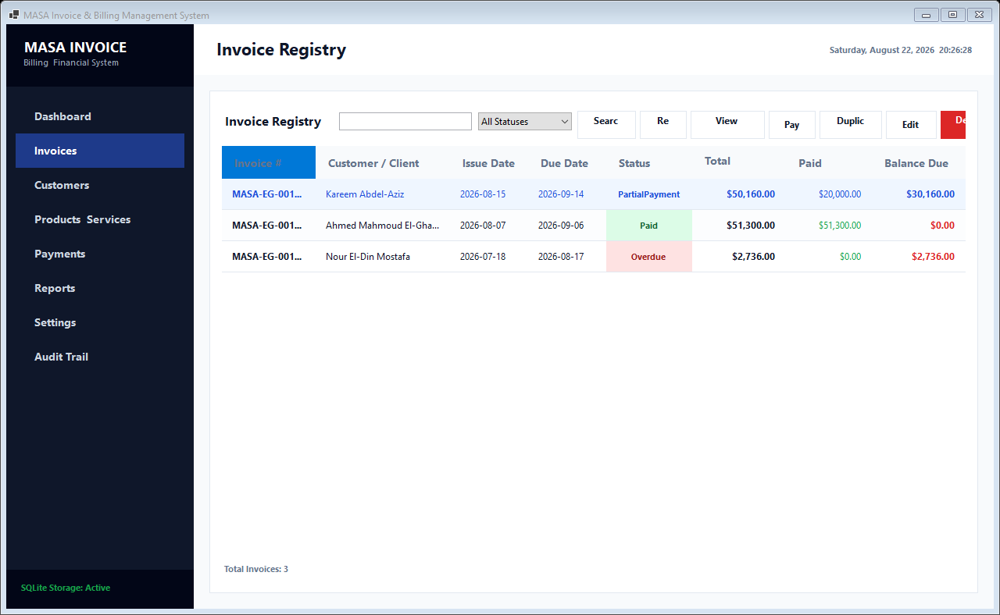 | 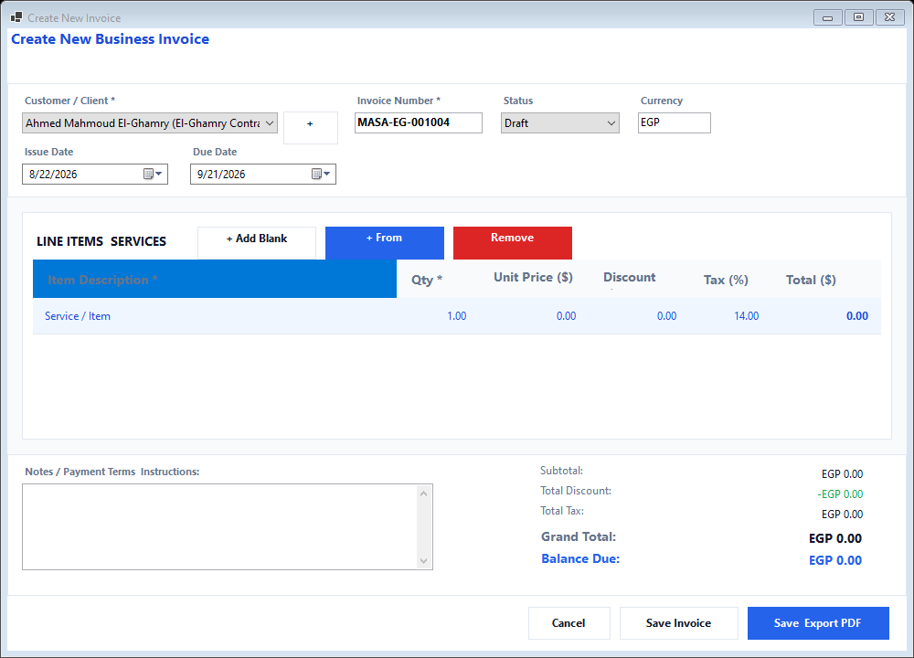 |

| Invoice Overview & PDF Export | Payment Recording Dialog |
| :---: | :---: |
| 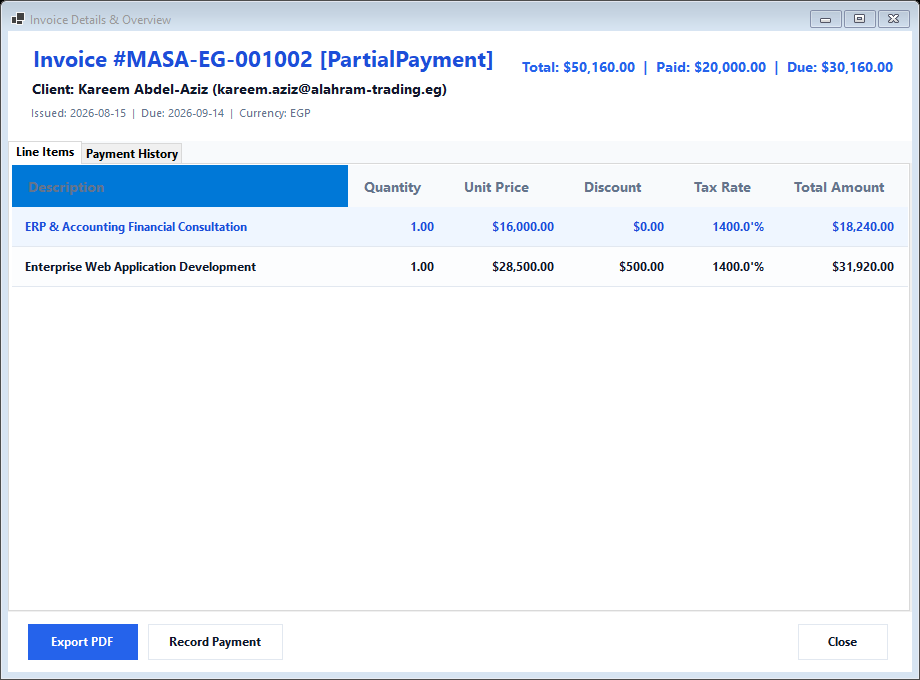 | 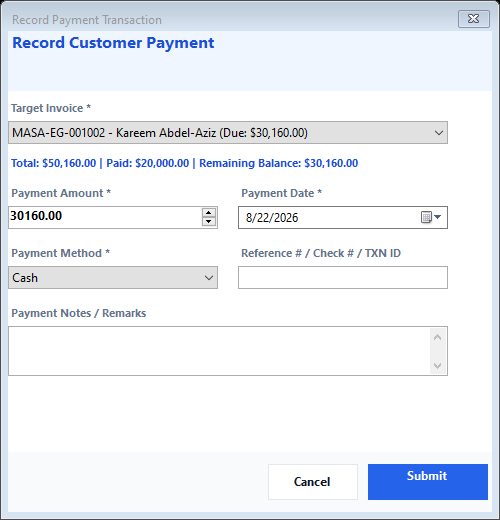 |

---

### 3. Customer Directory & Account Statements
| Customer Directory | Customer Account Statement Ledger |
| :---: | :---: |
| 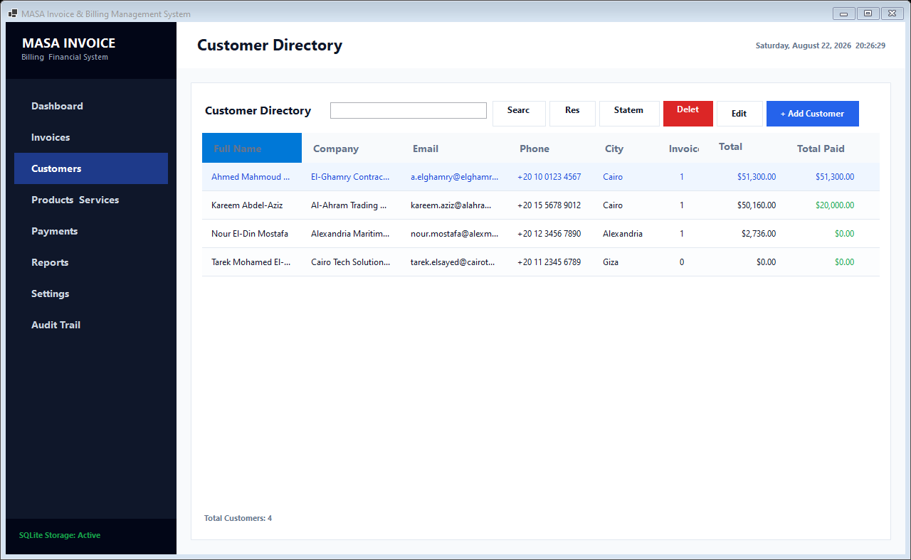 | 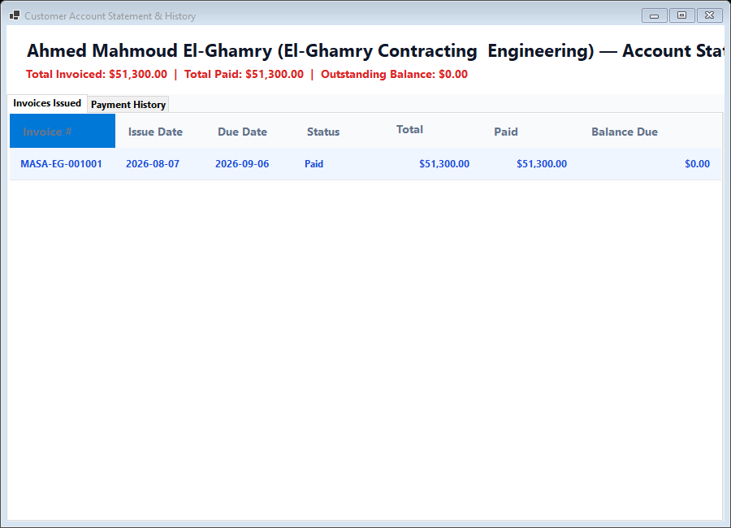 |

| Add / Edit Customer Dialog |
| :---: |
| 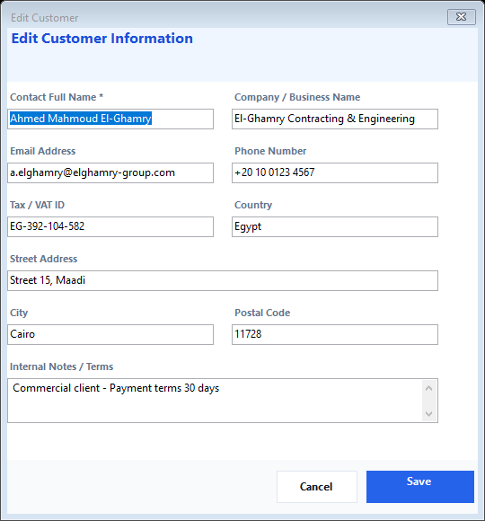 |

---

### 4. Products & Services Catalog
| Catalog & Inventory Tracking | Add / Edit Catalog Item |
| :---: | :---: |
| 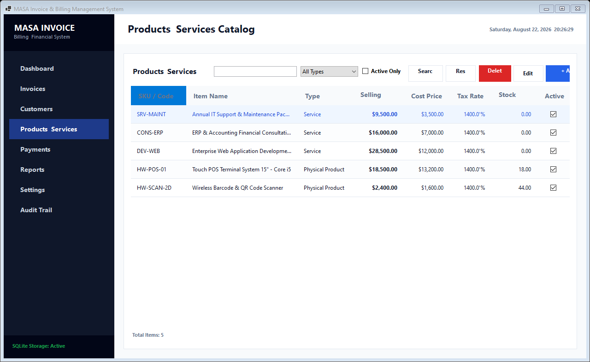 | 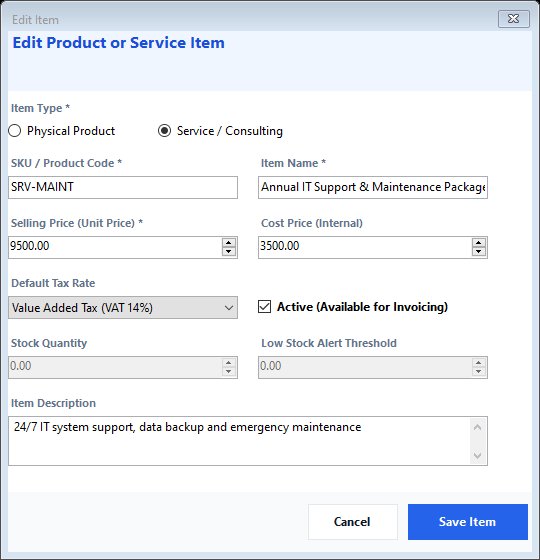 |

---

### 5. Payments & Business Intelligence Reports
| Payment Transactions Ledger | Financial & Sales Reports (CSV Export) |
| :---: | :---: |
| 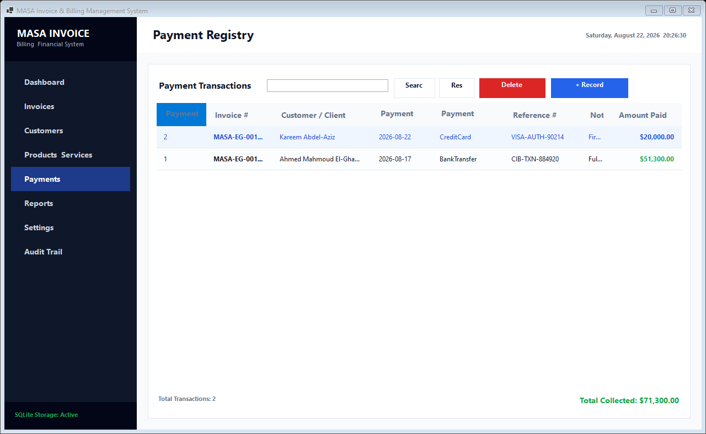 | 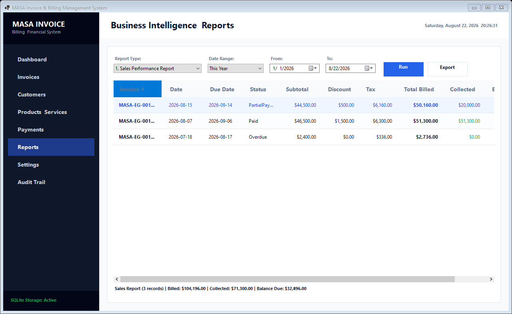 |

---

### 6. System Configuration & Audit Trail
| Company Profile & Numbering | Egyptian Tax Rates (VAT 14%) |
| :---: | :---: |
| 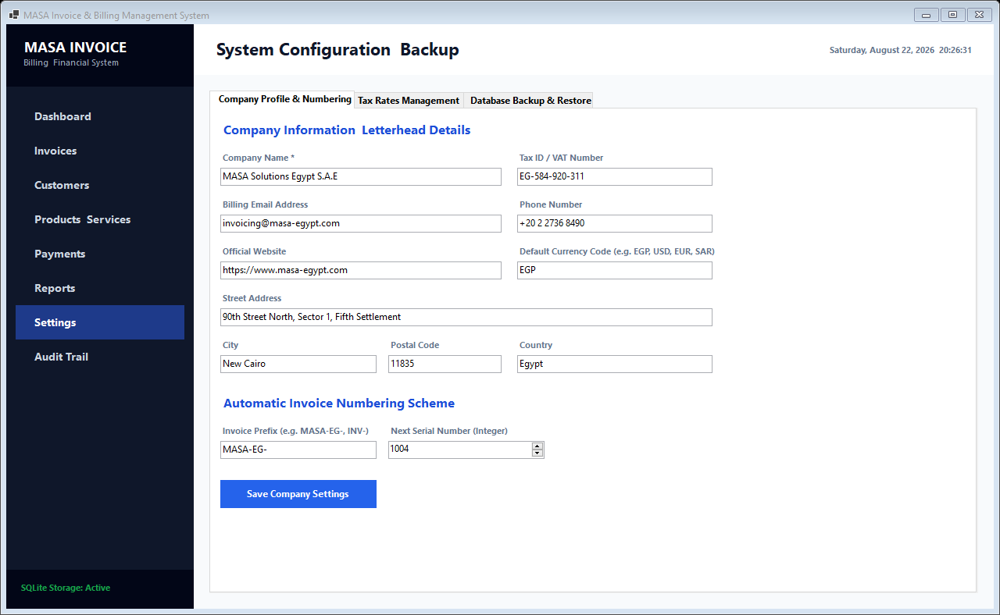 | 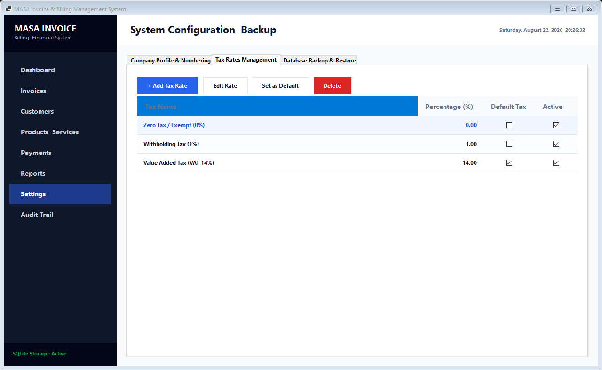 |

| SQLite Backup & Restore | System Activity & Audit Trail |
| :---: | :---: |
| 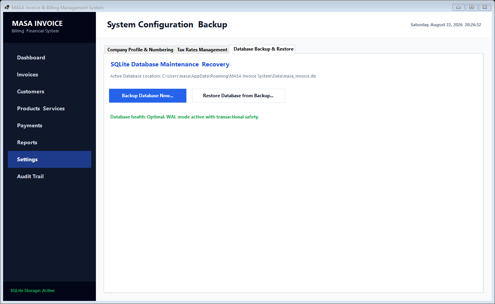 | 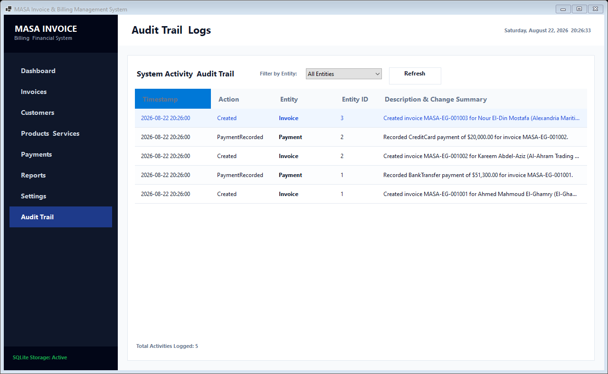 |

---

## Features

* **Executive Dashboard**: Real-time financial metrics, recent invoices & payments, and 6-month sales trend graphs.
* **Invoices Management**: Lifecycle tracking (`Draft`, `Sent`, `PartialPayment`, `Paid`, `Overdue`, `Cancelled`), customizable numbering (`MASA-EG-`), multi-item line calculations, and invoice duplication.
* **Customer Management**: Contact directory, account statements with transaction histories, and deletion protection for active accounts.
* **Products & Services Catalog**: Physical products with low stock alerts and hourly/fixed services with custom tax rates.
* **Payment Processing**: Flexible partial and full balance settlements with strict overpayment protection.
* **Professional PDF Generation**: QuestPDF vector invoice generation with letterhead, bill-to block, itemized tables, tax breakdown, and payment status badges.
* **Business Intelligence & Reporting**: 6 reports with date range filtering and one-click CSV export.
* **Database Maintenance**: SQLite automatic schema initialization, WAL mode, full backup creation, and binary-validated database restoration.
* **System Audit Trail**: Complete activity logs tracking creation, modifications, deletions, and payments.

---

## Architecture & Project Structure

```text
MASA.InvoiceSystem
│
├── src/
│   ├── MASA.InvoiceSystem.Domain/             # Business models, enums, exceptions & repository contracts
│   ├── MASA.InvoiceSystem.Application/        # Application services, DTOs, calculations & validation
│   ├── MASA.InvoiceSystem.Infrastructure/     # SQLite data access, Dapper repositories, Backup & QuestPDF
│   └── MASA.InvoiceSystem.WinForms/           # Windows Forms UI, views, dialogs, styling & themes
│
├── tests/
│   └── MASA.InvoiceSystem.Tests/              # Automated unit and integration tests (xUnit)
│
└── ScreenShot/                                # Application UI screenshots
```

---

## Getting Started

### Prerequisites

* [.NET 8.0 SDK](https://dotnet.microsoft.com/download/dotnet/8.0)
* Windows 10 / Windows 11 / Windows Server

### Build the Solution

```bash
dotnet build MASA.InvoiceSystem.sln
```

### Run Tests

```bash
dotnet test
```

### Run the Application

```bash
dotnet run --project src/MASA.InvoiceSystem.WinForms/MASA.InvoiceSystem.WinForms.vbproj
```

---

## Configuration & Storage

* Database location: `%AppData%\MASA Invoice System\Data\masa_invoice.db`
* Database backups can be saved to any chosen directory or external drive.

---

## Copyright & License

**All rights reserved © 2026 XREFS0.**

Source Code Repository: [https://github.com/XREFS0/MASA-Invoice-Generator](https://github.com/XREFS0/MASA-Invoice-Generator)

This project is open source and available under the [MIT License](LICENSE).
