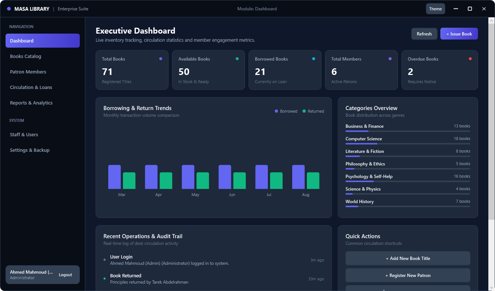
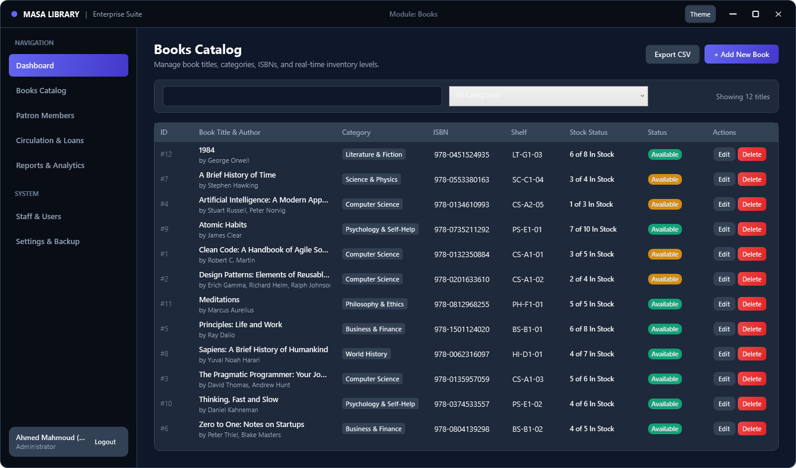
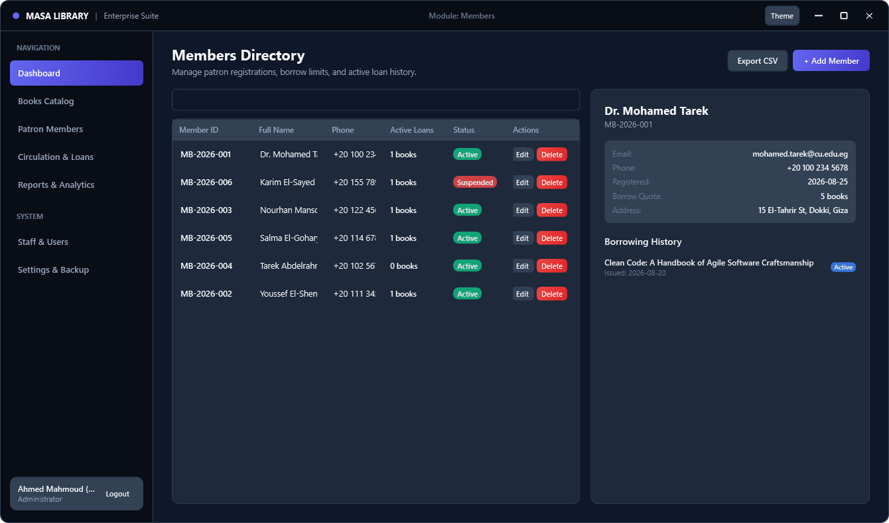
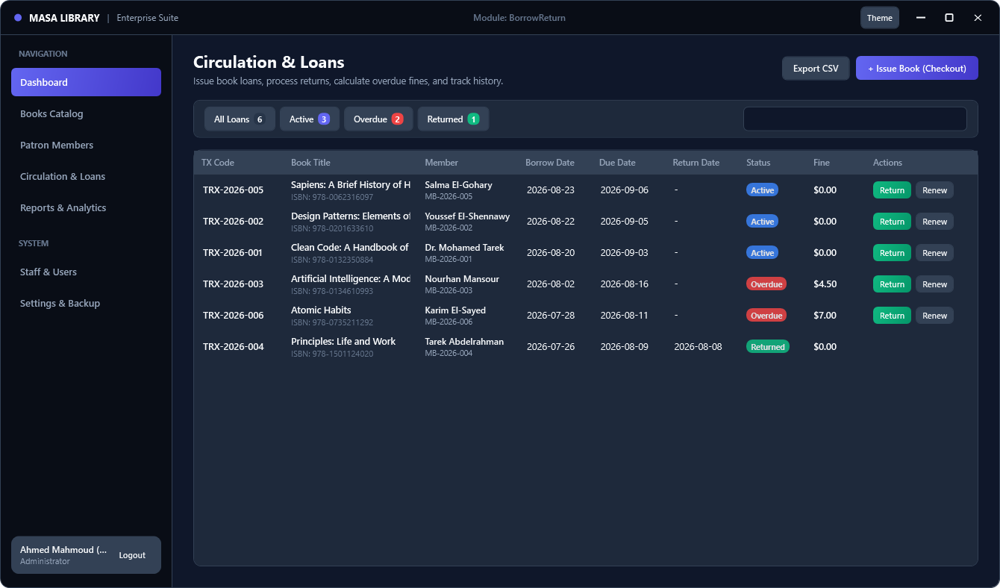
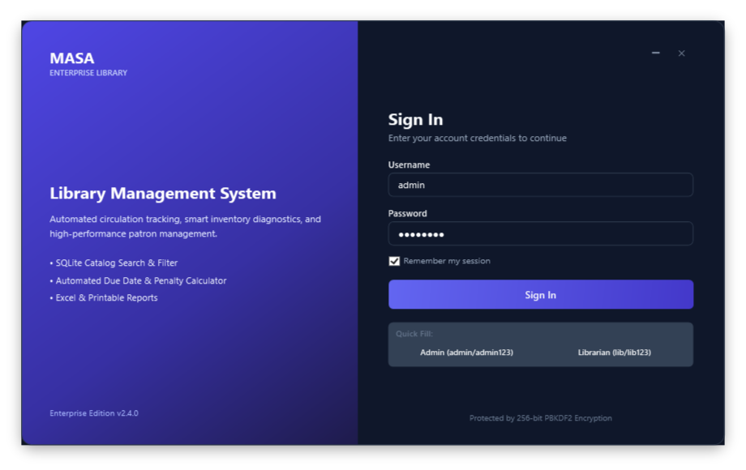

# Library Management System (MASA Enterprise Edition)

A modern desktop application for public, academic, and organizational library catalog management, circulation tracking, patron registry, and analytics reporting. Built on .NET 8 (WPF) with an embedded SQLite transactional database.

All rights reserved to **XREFS0** (c) 2026.

Repository: https://github.com/XREFS0/Library-Management-System

---

## Architectural Overview

The application follows the Model-View-ViewModel (MVVM) pattern combined with a clean Repository and Service-oriented data access layer:

- **Presentation Layer (UI/WPF)**: XAML layouts, theme resource dictionaries (Dark and Light modes), reusable user controls, and custom vector templates.
- **ViewModel Layer (MVVM)**: Pure decoupled state management, RelayCommand bindings, and UI event coordination.
- **Service Layer (Business)**: Transaction coordination, loan validity enforcement, overdue penalty calculations, SHA256/PBKDF2 security, theme persistence, and report formatting.
- **Data Access Layer (Data/Repositories)**: Strongly-typed CRUD operations via `Microsoft.Data.Sqlite`, parameterized queries, connection pooling, and schema migration.
- **Storage**: Local embedded SQLite database engine with zero external daemon configuration required.

---

## Key Modules & Features

### 1. Executive Analytics & Dashboard
- Real-time catalog summary counters (Total Books, In Stock, Active Loans, Registered Patrons, Overdue Notices).
- 6-month borrowing versus return distribution charts.
- Genre and category allocation progress trackers.
- Live activity audit log tracing all librarian and desk actions.

### 2. Catalog & Inventory Management
- Instant full-text search across Title, Author, ISBN, and Publisher.
- Category filtering with dynamic count indicators.
- In-stock inventory tracking with shelf location indices.
- Single-click CSV catalog export and print routines.

### 3. Patron & Member Directory
- Membership code generation and lifecycle management (`Active`, `Suspended`, `Inactive`).
- Configurable borrowing quotas per patron account.
- Complete borrowing history and active loan status inspection for each profile.

### 4. Circulation & Loan Desk
- Issue checkouts with custom loan durations and automated return date calculations.
- One-click book returns with automated overdue fine calculation ($0.50/day).
- Fast 14-day loan extension renewals.
- Status classification tabs: `All`, `Active`, `Overdue`, and `Returned`.

### 5. Staff & User Access Control
- Multi-tier role permissions: `Administrator`, `Librarian`, and `Staff`.
- Cryptographic password hashing using SHA256 with unique 128-bit cryptographic salts.
- Session activity logging with timestamp tracking.

### 6. Reports & Data Export
- Comprehensive tabular reporting engine for Loans, Inventory Stock, Patron Activity, and Overdue Collections.
- Date range filtering and primary/secondary metric aggregations.
- CSV spreadsheet export and formatted HTML/PDF printable summaries.

### 7. Maintenance & Backup Engine
- Single-click full database backup to `.bak` snapshots.
- Direct database restore functionality.
- Real-time database size calculation and audit log rotation.

---

## Visual Previews

### Dashboard & Analytics


### Catalog Management


### Patron Directory


### Circulation & Loans


### Authentication & Access


---

## Technical Specifications

| Parameter | Specification |
|---|---|
| Runtime | .NET 8.0 Windows Desktop SDK (net8.0-windows) |
| UI Framework | Windows Presentation Foundation (WPF) |
| Data Layer | Microsoft.Data.Sqlite (v10.0.11) |
| Security | SHA256 with RNGCryptoServiceProvider salt |
| Platform | Windows 10 / Windows 11 (x64, ARM64) |
| Minimum Resolution | 1050 x 720 (Recommended: 1340 x 820+) |

---

## Installation and Execution

### Prerequisites
- .NET 8.0 SDK or .NET Desktop Runtime 8.0 ([Download .NET 8](https://dotnet.microsoft.com/download/dotnet/8.0))

### Building from Source

```bash
# Clone the repository
git clone https://github.com/XREFS0/Library-Management-System.git
cd Library-Management-System

# Restore NuGet dependencies
dotnet restore

# Build project
dotnet build -c Release

# Run application
dotnet run -c Release
```

---

## Default Access Credentials

The database automatically seeds with default test accounts on initial launch:

| Role | Username | Default Password |
|---|---|---|
| Administrator | `admin` | `admin123` |
| Librarian | `librarian` | `lib123` |
| Staff | `staff` | `lib123` |

---

## Project Structure

```
.
├── Application.xaml              # WPF Application entry & theme resource loader
├── AssemblyInfo.vb               # Assembly metadata and manifest
├── MainWindow.xaml               # Primary shell layout, sidebar & view router
├── Business/                     # Domain services and business logic
│   ├── AuthService.vb            # Authentication and password hashing
│   ├── BackupService.vb          # SQLite database backup & restoration
│   ├── BookService.vb            # Catalog manipulation and stock calculations
│   ├── BorrowService.vb          # Loan issue, fine computation and returns
│   ├── DashboardService.vb       # Metric rollups and circulation charts
│   ├── ExportService.vb          # CSV and HTML report generators
│   ├── MemberService.vb          # Patron account operations
│   ├── NotificationService.vb    # Toast notification engine
│   └── ThemeService.vb           # Dark/Light theme coordinator
├── Data/                         # Database and storage abstractions
│   ├── DatabaseHelper.vb         # SQLite connection provider & execution helpers
│   ├── DatabaseInitializer.vb    # DDL migrations and seed dataset
│   └── Repositories/             # Data repository contracts and implementations
├── Models/                       # Domain data transfer entities and enums
├── UI/                           # Presentation components, styles and dialogs
│   ├── Controls/                 # Stat cards, toasts, and custom components
│   ├── Resources/                # Vector icons, palettes, and control templates
│   ├── Views/                    # Page views (Dashboard, Books, Members, etc.)
│   └── Windows/                  # Standalone modals and login window
├── ViewModels/                   # MVVM bindings, state and RelayCommands
└── ScreenShot/                   # High-resolution UI captures
```

---

## License & Copyright

Copyright (c) 2026 **XREFS0**.

Permission is hereby granted, free of charge, to any person obtaining a copy of this software and associated documentation files (the "Software"), to deal in the Software without restriction, including without limitation the rights to use, copy, modify, merge, publish, distribute, sublicense, and/or sell copies of the Software, subject to the standard MIT licensing conditions.
