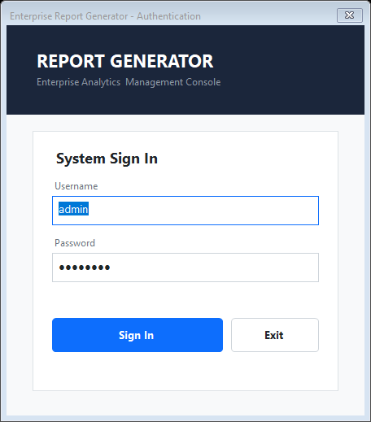
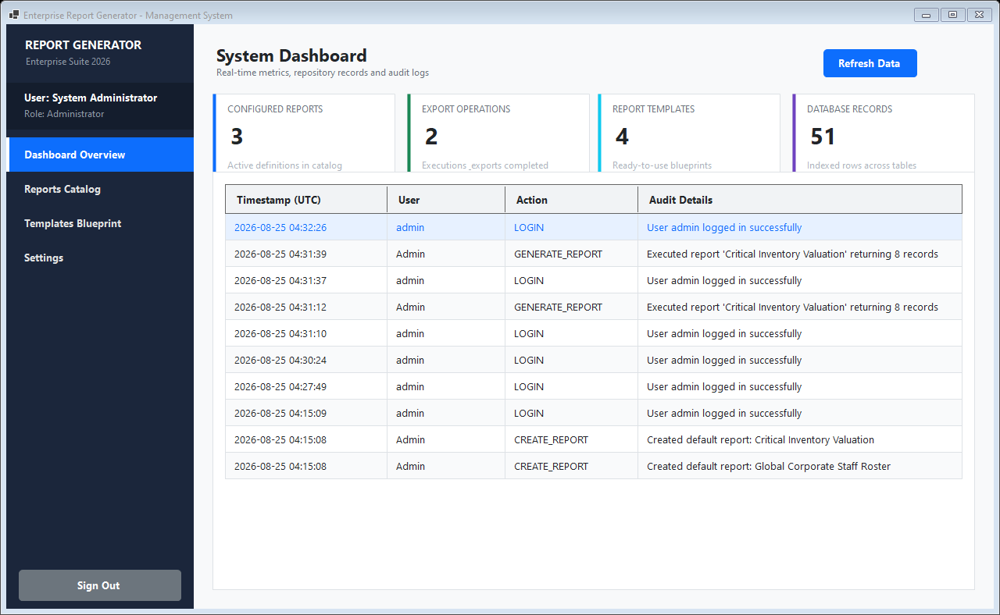
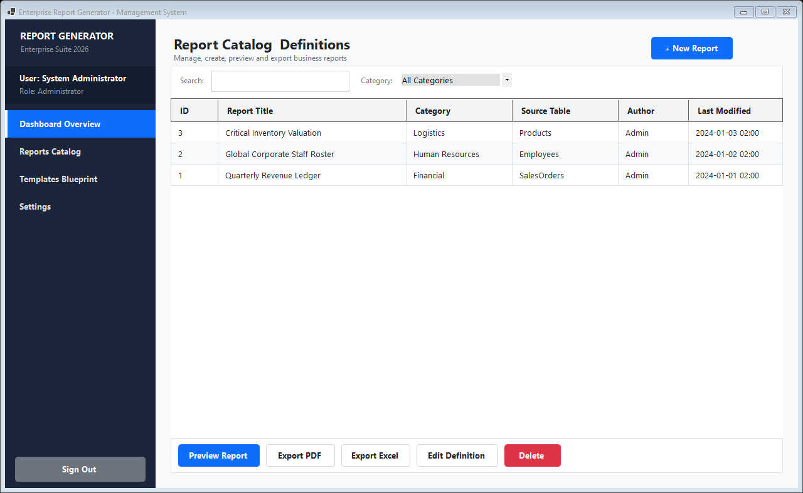
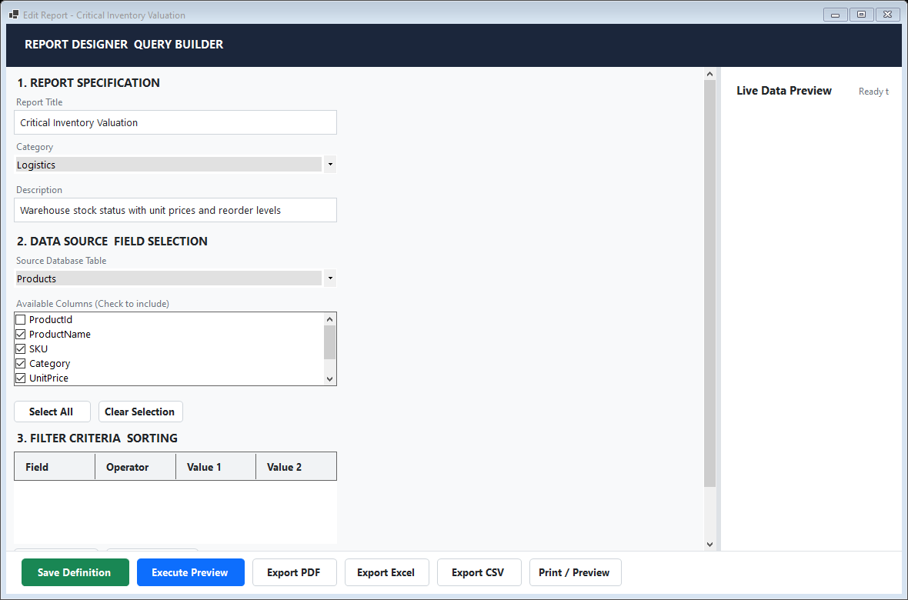
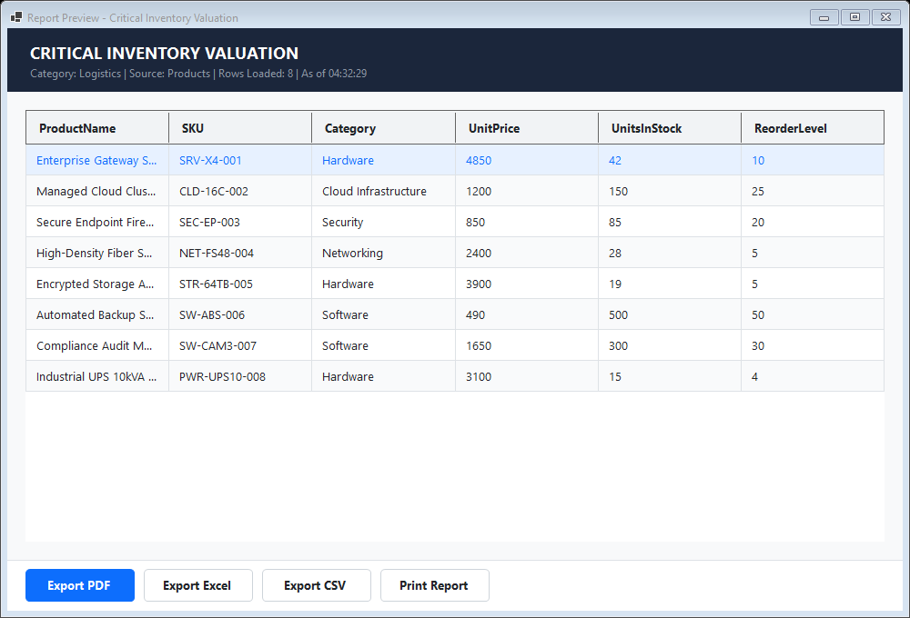
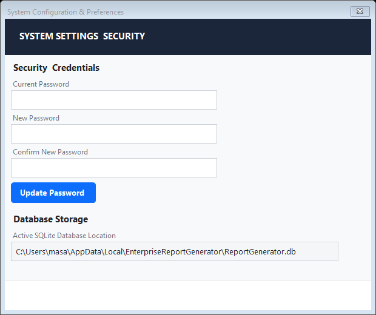

# ReportGenerator

Desktop reporting system built with **VB.NET**, **Windows Forms (.NET 8)**, and **SQLite**. Designed with a focus on Clean Architecture, clear separation of concerns, and native export capabilities.

All Rights Reserved to **XREFS0**  
Repository: [https://github.com/XREFS0/ReportGenerator](https://github.com/XREFS0/ReportGenerator)

---

## Overview

ReportGenerator provides an intuitive desktop interface to design, manage, preview, and export tabular reports from SQLite databases. It includes dynamic query construction, data filtering, multi-field sorting, and multi-format document exports without third-party visual control dependencies.

---

## Screenshots

### 1. Authentication Screen


### 2. Dashboard & System Metrics


### 3. Report Catalog & Management


### 4. Query Builder & Report Designer


### 5. Data Preview & Export Tools


### 6. Security & System Configuration


---

## Key Features

- **Dynamic Query Builder**: Select source database tables and columns interactively with custom filter conditions and sort orders.
- **Export Formats**:
  - **PDF**: Document generation with structured tables, headers, and page numbers using QuestPDF.
  - **Excel**: XML Spreadsheet export compatible with Microsoft Excel and LibreOffice Calc.
  - **CSV**: Standard comma-separated data export.
  - **Print**: Multi-page Windows Print Preview and direct printing support.
- **SQLite Engine**: Automatic schema creation and initialization on startup, with sample business tables (Departments, Employees, Customers, Products, Sales Orders).
- **Security**: SHA-256 salted password hashing and audit activity logging.
- **Enterprise Controls**: Custom-rendered flat controls (Cards, Buttons, Grids, Textboxes, and Navigation Tabs) built with GDI+ without icon clutter.

---

## Architecture

The project follows Clean Architecture principles divided into decoupled layers:

```
ReportGenerator/
|-- Presentation/
|   |-- Controls/           # Custom owner-drawn GDI+ controls (FlatButton, FlatCard, FlatGrid, etc.)
|   |-- Forms/              # User interface views (Login, Main, Dashboard, Catalog, Designer, Preview, Settings)
|   `-- Theme/              # Color palette, font definitions, and visual constants
|
|-- BusinessLogic/
|   |-- Models/             # Domain entities (User, ReportDefinition, ReportFilter, ActivityLog)
|   `-- Services/           # Application services (AuthService, ReportService, ReportExecutorService)
|
|-- DataAccess/
|   |-- Database/           # SQLite connection lifecycle and schema initializer
|   |-- Repositories/       # Data access repositories (ReportRepository, UserRepository, ActivityLogRepository)
|   `-- Schema/             # SQLite PRAGMA table and column introspection
|
|-- Utilities/              # Multi-format export services, cryptography, and JSON serialization
|-- ScreenShot/             # Application screenshots
`-- Tests/                  # Verification and integration check suite
```

---

## Prerequisites

- [.NET 8.0 SDK](https://dotnet.microsoft.com/download/dotnet/8.0) or later
- Windows 10 / 11 / Windows Server 2019+

---

## Getting Started

### 1. Clone the Repository

```bash
git clone https://github.com/XREFS0/ReportGenerator.git
cd ReportGenerator
```

### 2. Restore Dependencies and Build

```bash
dotnet restore
dotnet build -c Release
```

### 3. Run the Application

```bash
dotnet run
```

---

## Default Credentials

| Username | Password | Role |
| :--- | :--- | :--- |
| `admin` | `admin123` | Administrator |

---

## License

This project is licensed under the MIT License - see the [LICENSE](LICENSE) file for details.  
Copyright (c) 2026 XREFS0.
