# MASA Student Management System

[](https://github.com/XREFS0/MASA-Student-Management-System)
[](LICENSE)
[](https://dotnet.microsoft.com/)
[](https://supabase.com)

A desktop Student Management System engineered with **VB.NET Windows Forms** (.NET 8.0 Windows / .NET Framework 4.8 compatible) and backed by **Supabase PostgreSQL** via PostgREST and Auth APIs.

Built for universities, institutes, and academic organizations to manage admissions, faculty departments, courses, student attendance, exams, automated GPA calculation, transcripts, and audit logging.

**Repository URL**: [https://github.com/XREFS0/MASA-Student-Management-System](https://github.com/XREFS0/MASA-Student-Management-System)

---

## Screenshots & Interface Overview

### Database Architecture & ERD


---

### Dashboard & Analytics
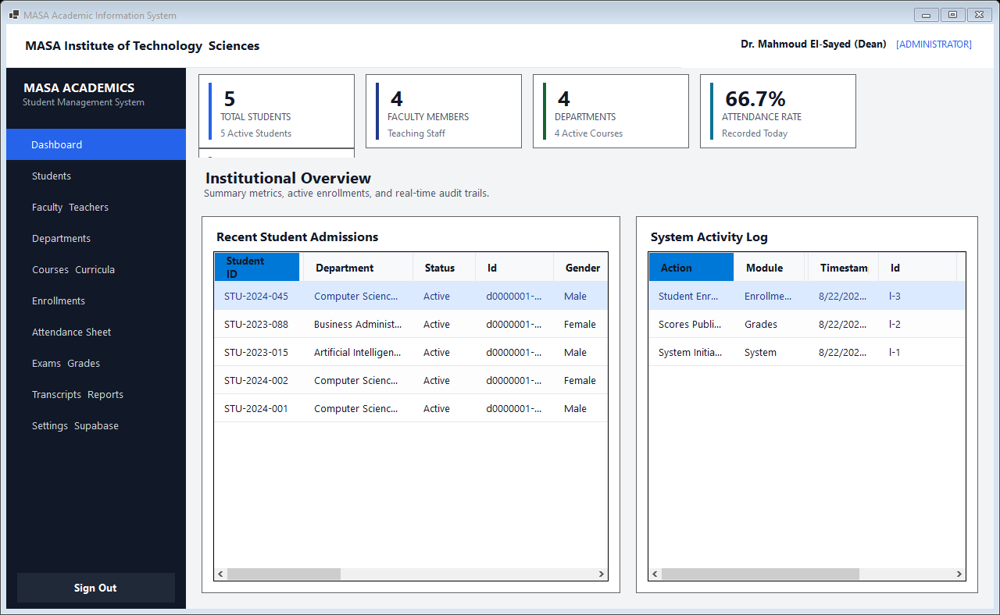

---

### Core Academic Modules

| Student Directory | Faculty & Instructors |
|:---:|:---:|
| 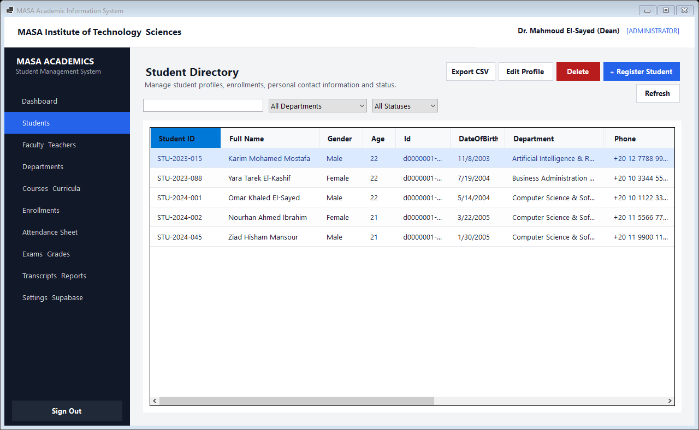 | 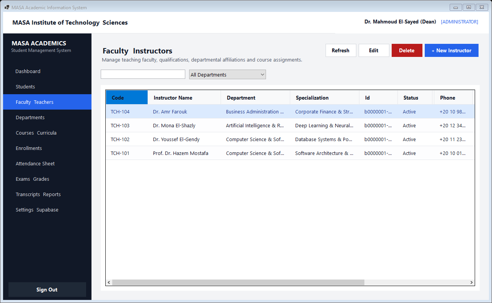 |

| Academic Departments | Courses & Curricula |
|:---:|:---:|
| 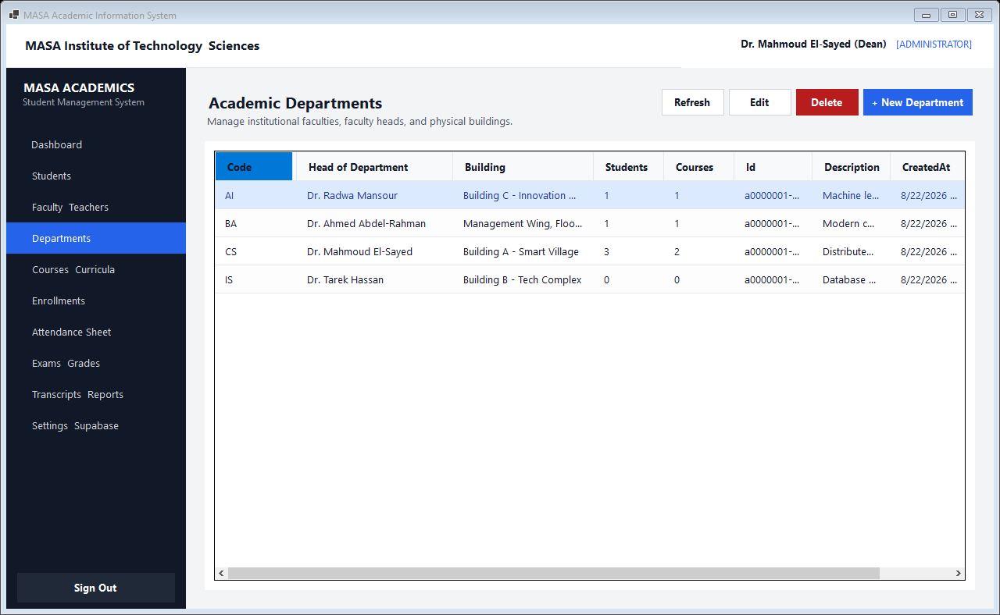 | 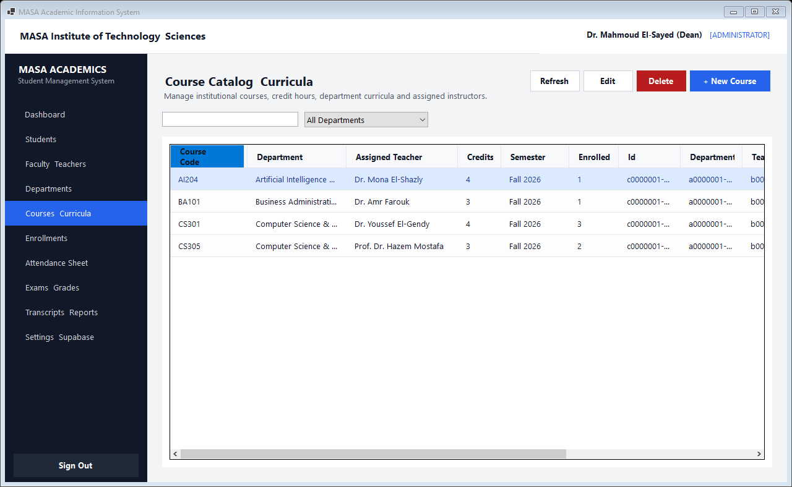 |

| Course Section Enrollments | Daily Attendance Registry |
|:---:|:---:|
| 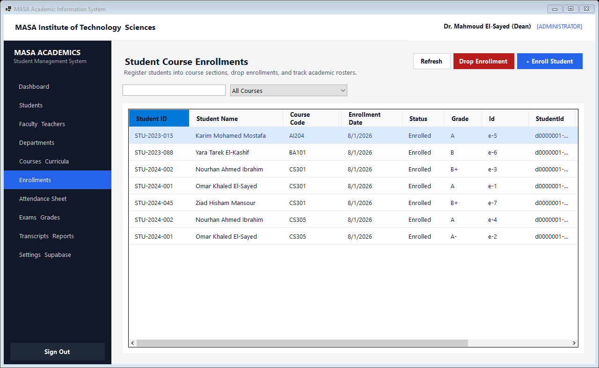 | 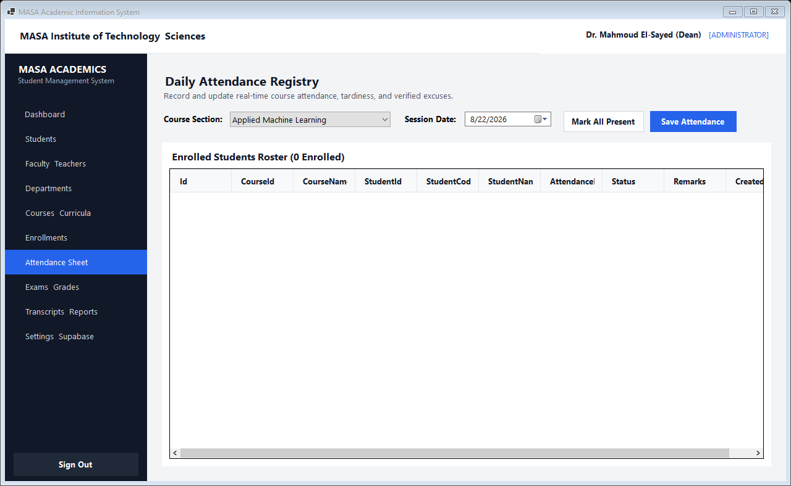 |

| Examinations & GPA Grading | Transcripts & Reports |
|:---:|:---:|
| 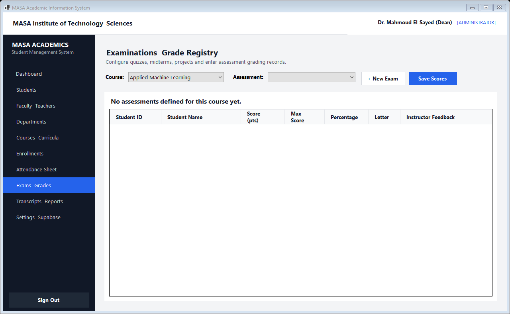 | 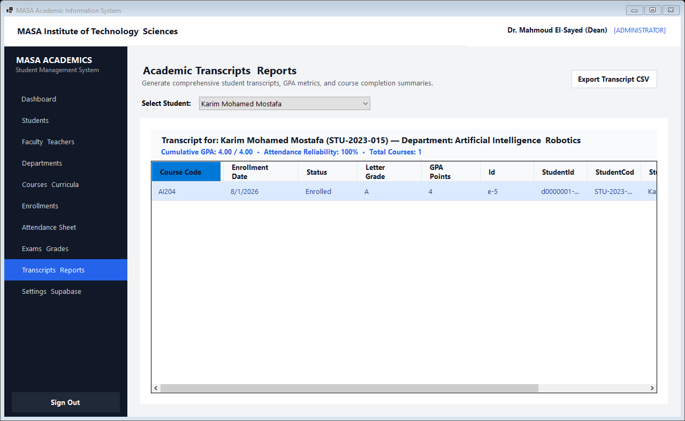 |

---

### Dialogs & Configuration

| Sign In Portal | Supabase Connection Settings |
|:---:|:---:|
| 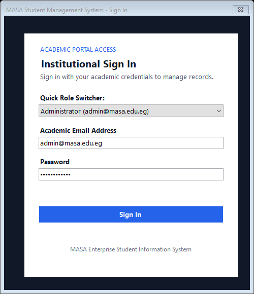 | 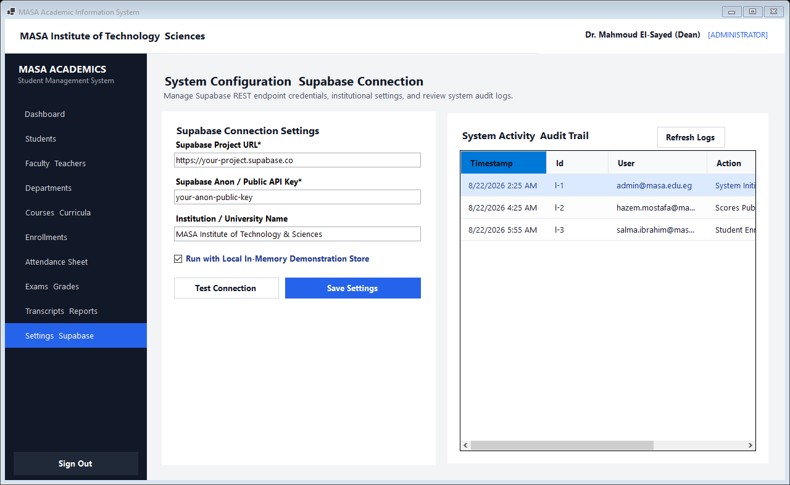 |

| Student Admission Form | Faculty Profile Editor |
|:---:|:---:|
| 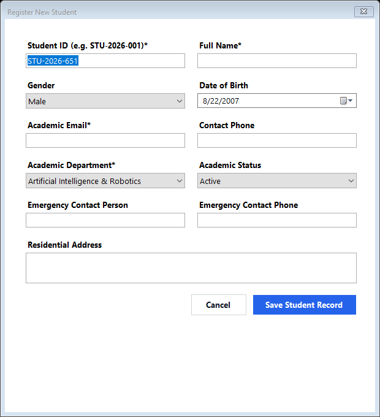 | 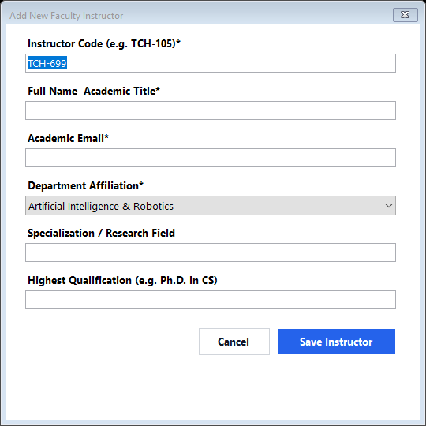 |

---

## Key Features

* **Multi-Role Access Control**: Tailored workflows and navigation for `Administrator`, `Teacher`, `Staff / Registrar`, and `Student`.
* **Academic Registries**:
  * **Departments**: Faculty buildings, head of department designations, and cascading dependency validation.
  * **Faculty & Instructors**: Teacher qualifications, academic titles, contact details, and department allocations.
  * **Students**: Full profiles, emergency contacts, academic statuses (`Active`, `Graduated`, `Suspended`, `Withdrawn`).
  * **Courses & Curricula**: Credit hours, semester terms, syllabus descriptions, and assigned professors.
  * **Enrollments**: Section registrations, duplicate enrollment protection, and enrollment drop workflows.
* **Attendance Management**: Fast batch attendance logging (`Present`, `Absent`, `Late`, `Excused`) with real-time student attendance rate tracking.
* **Exams & Grading**: Support for `Quiz`, `Assignment`, `Midterm`, `Final`, and `Project` assessments, dynamic weight percentages, automated percentage-to-letter grade conversion (`A+` to `F`), and 4.0 scale GPA calculation.
* **Academic Transcripts**: Cumulative GPA calculation, course completion history, and tabular CSV exporting.
* **Audit Trail & System Logs**: Activity logging for administrative operations, data modifications, and user logins.

---

## Architecture Overview

```text
MASA.StudentManagementSystem
├── Database/
│   └── schema.sql                  # PostgreSQL schema, foreign keys, and RLS policies
├── Configuration/
│   ├── AppConfig.vb                # JSON-backed configuration manager (appsettings.json)
├── Security/
│   ├── UserSession.vb              # Authentication state, token holder, and role verification
│   └── PasswordHelper.vb           # Cryptographic hashing helpers
├── Models/
│   └── DataModels.vb               # Strongly-typed domain models
├── Services/
│   ├── Supabase/
│   │   └── SupabaseClient.vb       # Asynchronous HTTP client for Supabase REST endpoints
│   ├── MockDataStore.vb            # In-memory mock engine for offline testing and demonstration
│   ├── AuthAndLogServices.vb       # Login/logout operations and activity logging
│   ├── AcademicEntityServices.vb   # Services for Departments, Teachers, and Students
│   └── AcademicOperationServices.vb# Services for Courses, Enrollments, Attendance, and Grades
├── Helpers/
│   └── UIHelpers.vb                # UI design system tokens, DataGridView styling, and CSV exporter
└── Forms/
    ├── Authentication/             # Sign-in window with multi-role quick switcher
    ├── Main/                       # Responsive shell containing sidebar navigation & header
    ├── Dashboard/                  # Executive KPI metrics & recent activity feed
    ├── Students/                   # Student directory & admission modal
    ├── Teachers/                   # Faculty directory & instructor modal
    ├── Departments/                # Department catalog & campus facilities
    ├── Courses/                    # Course curricula & instructor assignment
    ├── Enrollments/                # Course section enrollment roster
    ├── Attendance/                 # Daily course attendance sheet
    ├── Grades/                     # Assessment definitions & scoring sheet
    ├── Reports/                    # Transcripts & academic reporting
    └── Settings/                   # Live Supabase connection testing & audit log viewer
```

---

## Prerequisites

* [.NET SDK 8.0](https://dotnet.microsoft.com/download) or Visual Studio 2022 (with .NET desktop development workload).
* A [Supabase](https://supabase.com) project instance (or run with built-in in-memory demo mode).

---

## Database Setup

1. Log in to your **Supabase Dashboard**.
2. Navigate to **SQL Editor** -> **+ New Query**.
3. Copy the full contents of [`Database/schema.sql`](Database/schema.sql) and click **Run**.
4. All tables, constraints, indexes, Row Level Security (RLS) policies, and sample seed data will be created.

---

## Configuration

Copy `appsettings.example.json` to `appsettings.json` (or update it directly from the application settings screen):

```json
{
  "SupabaseUrl": "https://your-project.supabase.co",
  "SupabaseAnonKey": "your-anon-public-key",
  "AppTitle": "MASA Student Management System",
  "InstitutionName": "MASA Institute of Technology & Sciences",
  "RequestTimeoutSeconds": 30,
  "AutoSaveAuditLogs": true,
  "DemoMode": false
}
```

*Set `"DemoMode": true` if you want to run the application immediately without an active internet connection.*

---

## Building and Running

### Using .NET CLI
```bash
# Clone the repository
git clone https://github.com/XREFS0/MASA-Student-Management-System.git
cd MASA-Student-Management-System

# Restore and build the project
dotnet build

# Run the application
dotnet run
```

### Default Demo Credentials

| Role | Email | Password |
|---|---|---|
| Administrator | `admin@masa.edu.eg` | `Password123!` |
| Faculty Teacher | `hazem.mostafa@masa.edu.eg` | `Password123!` |
| Staff / Registrar | `salma.ibrahim@masa.edu.eg` | `Password123!` |
| Student | `omar.khaled@masa.edu.eg` | `Password123!` |

---

## Copyright & Author

Developed and Maintained by **[XREFS0](https://github.com/XREFS0)**.

Project Link: [https://github.com/XREFS0/MASA-Student-Management-System](https://github.com/XREFS0/MASA-Student-Management-System)

---

## License

This project is licensed under the MIT License - see the [LICENSE](LICENSE) file for details.
All rights reserved © 2026 XREFS0.
